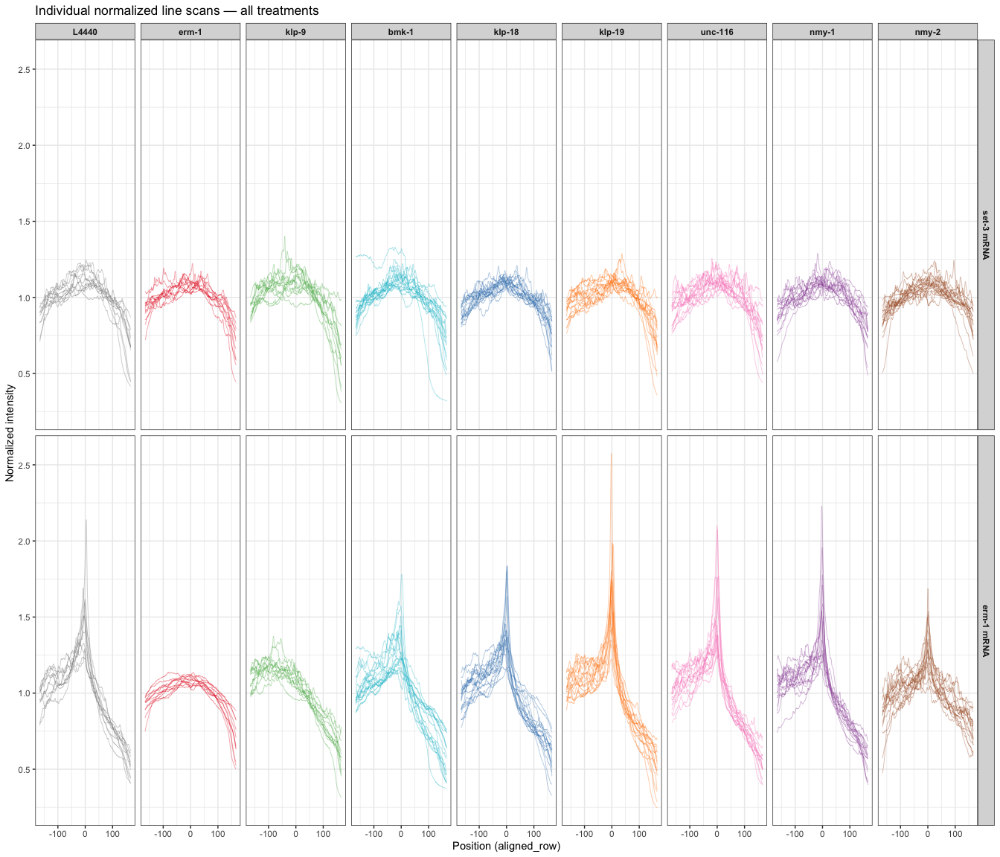
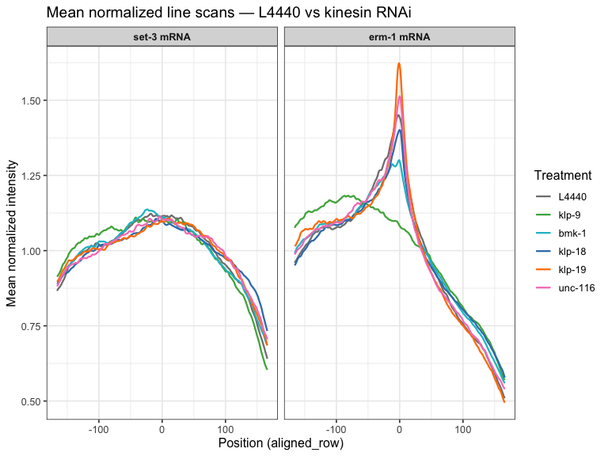
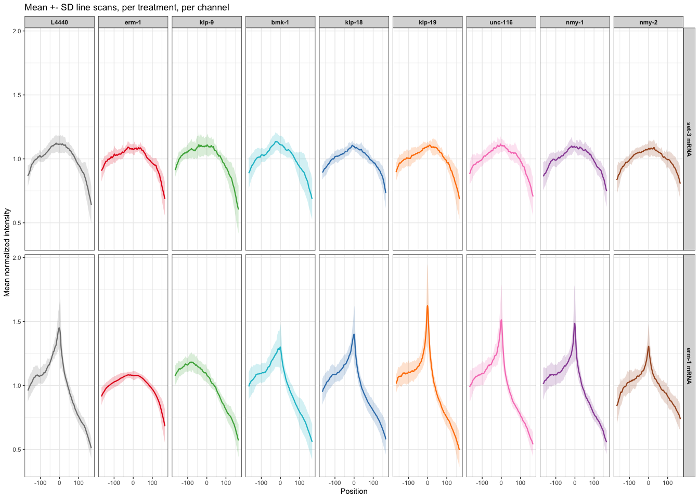
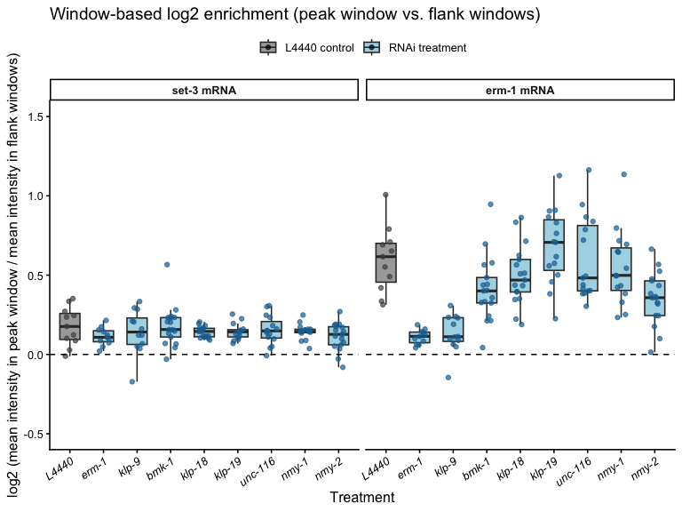
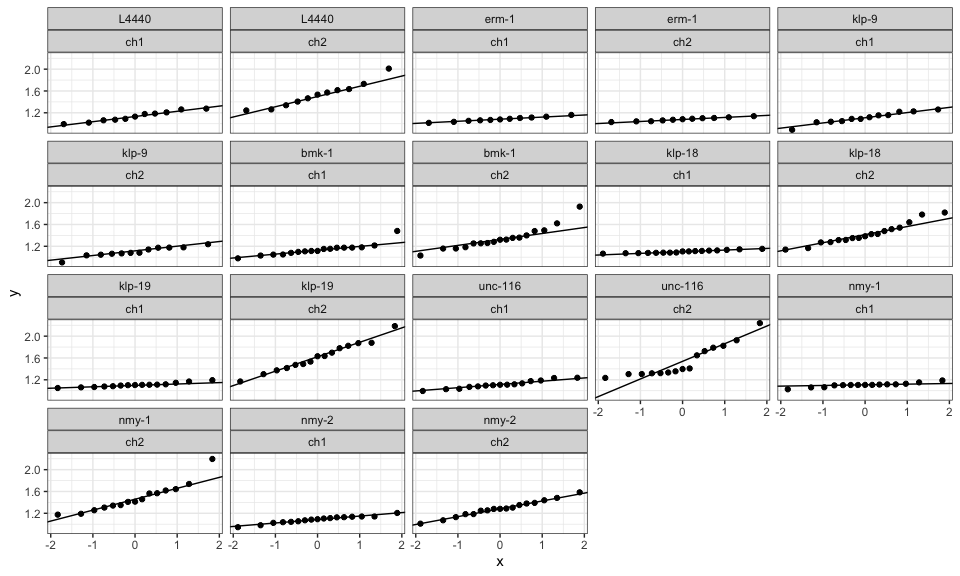

erm-1 RNAi Treatments — Merged Analysis
================
Sam Zavislan-Pullaro
2026-09-14

- [Load libraries](#load-libraries)
- [Import data](#import-data)
- [Create annotation columns and add
  timepoints](#create-annotation-columns-and-add-timepoints)
- [Merge all data and apply fixed coordinate
  alignment](#merge-all-data-and-apply-fixed-coordinate-alignment)
- [Normalize](#normalize)
- [Color palettes](#color-palettes)
- [Section 1: Individual normalized line
  scans](#section-1-individual-normalized-line-scans)
- [Section 2: Mean +- SD line scans](#section-2-mean---sd-line-scans)
  - [2a. All treatments overlaid, one panel per
    channel](#2a-all-treatments-overlaid-one-panel-per-channel)
  - [2b. L4440 vs kinesins KDs](#2b-l4440-vs-kinesins-kds)
  - [2c. L4440 vs each RNAi treatment, faceted
    grid](#2c-l4440-vs-each-rnai-treatment-faceted-grid)
- [Section 3: log2 fold change
  enrichment](#section-3-log2-fold-change-enrichment)
  - [3a. Merged boxplot, x-axis by treatment, faceted by
    channel](#3a-merged-boxplot-x-axis-by-treatment-faceted-by-channel)
  - [3b. Merged boxplot, x-axis by channel, faceted by
    treatment](#3b-merged-boxplot-x-axis-by-channel-faceted-by-treatment)
- [Summary statistics](#summary-statistics)
- [Statistics](#statistics)
- [Section 4: Window-based membrane-y-ness (alternative to single-point
  fc_enrich)](#section-4-window-based-membrane-y-ness-alternative-to-single-point-fc_enrich)
  - [4a. Calculate the window-based ratio, all
    treatments](#4a-calculate-the-window-based-ratio-all-treatments)
  - [4b. Summary statistics,
    window-based](#4b-summary-statistics-window-based)
  - [4c. Boxplots, window-based](#4c-boxplots-window-based)
  - [4d. Check assumptions](#4d-check-assumptions)
  - [4e. Pairwise Wilcoxon vs L4440,
    window-based](#4e-pairwise-wilcoxon-vs-l4440-window-based)
- [Export plots and stats](#export-plots-and-stats)
- [Session info](#session-info)

## Load libraries

``` r
library(tidyverse)
library(data.table)
library(rstatix)
library(ggrepel)
library(gridExtra)
```

------------------------------------------------------------------------

## Import data

Note: channel 1 = set-3 mRNA \| channel 2 = erm-1 mRNA

L4440 control files are loaded once and shared across all treatment
comparisons.

``` r
col_times <- paste(rep(1:333), sep = "")

# L4440
control_1 <- read.table("../01_input/2026-6-22_1458_datafile_for_230713_L4440_RNAi_rep1.txt",
                        header = FALSE, sep = "\t")
control_2 <- read.table("../01_input/2026-6-22_153_datafile_for_230828_L4440_RNAi_rep2.txt",
                        header = FALSE, sep = "\t")
control_3 <- read.table("../01_input/2026-6-22_156_datafile_for_240122_LP306_L4440-rep3.txt",
                        header = FALSE, sep = "\t")

colnames(control_1) <- c("file", "channel", col_times)
colnames(control_2) <- c("file", "channel", col_times)
colnames(control_3) <- c("file", "channel", col_times)

# erm-1 KD
erm1_1 <- read.table("../01_input/2026-6-24_2158_datafile_for_240219_LP306_ERM-1-rep1.txt",
                     header = FALSE, sep = "\t")
erm1_2 <- read.table("../01_input/2026-6-24_222_datafile_for_240221_LP306_ERM-1_RNAi-rep2.txt",
                     header = FALSE, sep = "\t")
erm1_3 <- read.table("../01_input/2026-6-24_224_datafile_for_240222_LP306_ERM-1_RNAi-rep3.txt",
                     header = FALSE, sep = "\t")

colnames(erm1_1) <- c("file", "channel", col_times)
colnames(erm1_2) <- c("file", "channel", col_times)
colnames(erm1_3) <- c("file", "channel", col_times)

# klp-18 KD
klp18_1 <- read.table("../01_input/2026-6-22_1254_datafile_for_231207_LP306_klp-18_rep1.txt",
                      header = FALSE, sep = "\t")
klp18_2 <- read.table("../01_input/2026-6-22_1259_datafile_for_231208_LP306_klp-18_rep2.txt",
                      header = FALSE, sep = "\t")
klp18_3 <- read.table("../01_input/2026-6-22_135_datafile_for_231224_LP306_klp-18_RNAi-rep3.txt",
                      header = FALSE, sep = "\t")

colnames(klp18_1) <- c("file", "channel", col_times)
colnames(klp18_2) <- c("file", "channel", col_times)
colnames(klp18_3) <- c("file", "channel", col_times)

# klp-19 KD
klp19_1 <- read.table("../01_input/2026-6-22_1335_datafile_for_231228_LP306_KLP-19-rep1.txt",
                      header = FALSE, sep = "\t")
klp19_2 <- read.table("../01_input/2026-6-23_174_datafile_for_240122_LP306_KLP-19-rep2.txt",
                      header = FALSE, sep = "\t")
klp19_3 <- read.table("../01_input/2026-6-23_1712_datafile_for_240123_LP306_KLP-19_rep3.txt",
                      header = FALSE, sep = "\t")

colnames(klp19_1) <- c("file", "channel", col_times)
colnames(klp19_2) <- c("file", "channel", col_times)
colnames(klp19_3) <- c("file", "channel", col_times)

# klp-9 KD
klp9_1 <- read.table("../01_input/2026-6-23_1559_datafile_for_231207_LP306_KLP-9.txt",
                     header = FALSE, sep = "\t")
klp9_2 <- read.table("../01_input/2026-6-23_162_datafile_for_231208_LP306_KLP-9_rep2.txt",
                     header = FALSE, sep = "\t")
klp9_3 <- read.table("../01_input/2026-6-23_166_datafile_for_231224_LP306_klp-9_rep3.txt",
                     header = FALSE, sep = "\t")

colnames(klp9_1) <- c("file", "channel", col_times)
colnames(klp9_2) <- c("file", "channel", col_times)
colnames(klp9_3) <- c("file", "channel", col_times)

# nmy-1 KD
nmy1_1 <- read.table("../01_input/2026-6-24_117_datafile_for_240108_NMY-1_RNAi-rep1.txt",
                     header = FALSE, sep = "\t")
nmy1_2 <- read.table("../01_input/2026-6-24_1116_datafile_for_240217_LP306_NMY-1_RNAi-rep2.txt",
                     header = FALSE, sep = "\t")
nmy1_3 <- read.table("../01_input/2026-6-24_1124_datafile_for_240221_LP306_NMY-1_RNAi-rep3.txt",
                     header = FALSE, sep = "\t")

colnames(nmy1_1) <- c("file", "channel", col_times)
colnames(nmy1_2) <- c("file", "channel", col_times)
colnames(nmy1_3) <- c("file", "channel", col_times)

# nmy-2 KD
nmy2_1 <- read.table("../01_input/2026-6-24_1156_datafile_for_240113_NMY-2_RNAi-rep1.txt",
                     header = FALSE, sep = "\t")
nmy2_2 <- read.table("../01_input/2026-6-24_122_datafile_for_240122_LP306_NMY-2.txt",
                     header = FALSE, sep = "\t")
nmy2_3 <- read.table("../01_input/2026-6-24_129_datafile_for_240123_NMY-2_RNAi-rep2.txt",
                     header = FALSE, sep = "\t")
nmy2_4 <- read.table("../01_input/2026-6-24_147_datafile_for_240221_LP306_NMY-2_RNAi-rep3.txt",
                     header = FALSE, sep = "\t")

colnames(nmy2_1) <- c("file", "channel", col_times)
colnames(nmy2_2) <- c("file", "channel", col_times)
colnames(nmy2_3) <- c("file", "channel", col_times)
colnames(nmy2_4) <- c("file", "channel", col_times)

# unc-116 KD
unc116_1 <- read.table("../01_input/2026-6-24_1850_datafile_for_231228_LP306_UNC-116-rep1.txt",
                       header = FALSE, sep = "\t")
unc116_2 <- read.table("../01_input/2026-6-24_1854_datafile_for_240106_LP306_UNC-116_RNAi-rep2.txt",
                       header = FALSE, sep = "\t")
unc116_3 <- read.table("../01_input/2026-6-24_1856_datafile_for_240120_LP306_UNC-116_RNAi-rep3.txt",
                       header = FALSE, sep = "\t")
unc116_4 <- read.table("../01_input/2026-6-24_191_datafile_for_240123_UNC116-rep4.txt",
                       header = FALSE, sep = "\t")

colnames(unc116_1) <- c("file", "channel", col_times)
colnames(unc116_2) <- c("file", "channel", col_times)
colnames(unc116_3) <- c("file", "channel", col_times)
colnames(unc116_4) <- c("file", "channel", col_times)

# bmk-1 RNAi KD
bmk1_1 <- read.table("../01_input/2026-6-22_1528_datafile_for_220719_LP306_bmk-1_RNAi.txt",
                     header = FALSE, sep = "\t")
bmk1_2 <- read.table("../01_input/2026-6-22_1536_datafile_for_230408_LP306_BMK-1_rep1.txt",
                     header = FALSE, sep = "\t")
bmk1_3 <- read.table("../01_input/2026-6-22_1544_datafile_for_231107_LP306_BMK-1_rep2.txt",
                     header = FALSE, sep = "\t")
bmk1_4 <- read.table("../01_input/2026-6-22_1550_datafile_for_231113_LP306_BMK-1_rep3.txt",
                     header = FALSE, sep = "\t")

colnames(bmk1_1) <- c("file", "channel", col_times)
colnames(bmk1_2) <- c("file", "channel", col_times)
colnames(bmk1_3) <- c("file", "channel", col_times)
colnames(bmk1_4) <- c("file", "channel", col_times)
```

------------------------------------------------------------------------

## Create annotation columns and add timepoints

Timepoints are treated as positions along line scan

``` r
# Helper: pivot longer + annotate ─────────────────────────────────────────────
annotate_df <- function(df) {
  df[2:nrow(df), 1:335] %>%
    separate_wider_delim(file, delim = "_",
                         names = c("date", "strain", "treatment", "embryoID", NA)) %>%
    pivot_longer(cols = `1`:`333`, names_to = "xpoint", values_to = "intensity") %>%
    mutate(unique_id = paste(date, strain, treatment, embryoID, channel, sep = "_"))
}

# Helper: add timepoints from the header row of any loaded table ──────────────
addInTimepoints <- function(tibble, ref_table) {
  timepoints <- as.vector(unlist(ref_table[1, 3:335]))
  repnumb    <- nrow(tibble) / 333
  tibble::add_column(tibble, timepoints = rep(timepoints, repnumb), .after = "xpoint")
}

# Controls
ctrl1_pt <- addInTimepoints(annotate_df(control_1), control_1)
ctrl2_pt <- addInTimepoints(annotate_df(control_2), control_1)
ctrl3_pt <- addInTimepoints(annotate_df(control_3), control_1)

# erm-1
erm1_1_pt <- addInTimepoints(annotate_df(erm1_1), control_1)
erm1_2_pt <- addInTimepoints(annotate_df(erm1_2), control_1)
erm1_3_pt <- addInTimepoints(annotate_df(erm1_3), control_1)

# klp-18
klp18_1_pt <- addInTimepoints(annotate_df(klp18_1), control_1)
klp18_2_pt <- addInTimepoints(annotate_df(klp18_2), control_1)
klp18_3_pt <- addInTimepoints(annotate_df(klp18_3), control_1)

# klp-19
klp19_1_pt <- addInTimepoints(annotate_df(klp19_1), control_1)
klp19_2_pt <- addInTimepoints(annotate_df(klp19_2), control_1)
klp19_3_pt <- addInTimepoints(annotate_df(klp19_3), control_1)

# klp-9
klp9_1_pt <- addInTimepoints(annotate_df(klp9_1), control_1)
klp9_2_pt <- addInTimepoints(annotate_df(klp9_2), control_1)
klp9_3_pt <- addInTimepoints(annotate_df(klp9_3), control_1)

# nmy-1
nmy1_1_pt <- addInTimepoints(annotate_df(nmy1_1), control_1)
nmy1_2_pt <- addInTimepoints(annotate_df(nmy1_2), control_1)
nmy1_3_pt <- addInTimepoints(annotate_df(nmy1_3), control_1)

# nmy-2
nmy2_1_pt <- addInTimepoints(annotate_df(nmy2_1), control_1)
nmy2_2_pt <- addInTimepoints(annotate_df(nmy2_2), control_1)
nmy2_3_pt <- addInTimepoints(annotate_df(nmy2_3), control_1)
nmy2_4_pt <- addInTimepoints(annotate_df(nmy2_4), control_1)

# unc-116
unc116_1_pt <- addInTimepoints(annotate_df(unc116_1), control_1)
unc116_2_pt <- addInTimepoints(annotate_df(unc116_2), control_1)
unc116_3_pt <- addInTimepoints(annotate_df(unc116_3), control_1)
unc116_4_pt <- addInTimepoints(annotate_df(unc116_4), control_1)

# bmk-1
bmk1_1_pt <- addInTimepoints(annotate_df(bmk1_1), control_1)
bmk1_2_pt <- addInTimepoints(annotate_df(bmk1_2), control_1)
bmk1_3_pt <- addInTimepoints(annotate_df(bmk1_3), control_1)
bmk1_4_pt <- addInTimepoints(annotate_df(bmk1_4), control_1)
```

------------------------------------------------------------------------

## Merge all data and apply fixed coordinate alignment

L4440 controls are included once (shared reference across all
experiments). Peak alignment is skipped: every embryo receives the same
fixed coordinate, recentered so xpoint 1:333 maps to aligned_row
-166:166.

``` r
all_data <- rbind(
  ctrl1_pt,   ctrl2_pt,   ctrl3_pt,
  erm1_1_pt,  erm1_2_pt,  erm1_3_pt,
  klp18_1_pt, klp18_2_pt, klp18_3_pt,
  klp19_1_pt, klp19_2_pt, klp19_3_pt,
  klp9_1_pt,  klp9_2_pt,  klp9_3_pt,
  nmy1_1_pt,  nmy1_2_pt,  nmy1_3_pt,
  nmy2_1_pt,  nmy2_2_pt,  nmy2_3_pt,  nmy2_4_pt,
  unc116_1_pt, unc116_2_pt, unc116_3_pt, unc116_4_pt,
  bmk1_1_pt,   bmk1_2_pt,   bmk1_3_pt,   bmk1_4_pt
)

dt <- as.data.table(all_data)
dt$xpoint <- as.integer(dt$xpoint)
dt[, aligned_row := xpoint - 167]

total_align_long <- dt %>%
  select(strain, aligned_row, unique_id, intensity)

cat("Total rows:", nrow(total_align_long), "\n")
```

    ## Total rows: 86580

``` r
cat("Unique embryo IDs:", n_distinct(total_align_long$unique_id), "\n")
```

    ## Unique embryo IDs: 260

------------------------------------------------------------------------

## Normalize

Each embryo is normalized to its own mean intensity (per embryo per
channel).

``` r
norm_total <- total_align_long %>%
  separate_wider_delim(unique_id, delim = "_",
                       names = c("date", NA, "treatment", "embryoID", "channel")) %>%
  group_by(date, embryoID, channel, treatment) %>%
  mutate(normalized_intensity = intensity / mean(intensity, na.rm = TRUE)) %>%
  ungroup()

treatment_order <- c("L4440", "erm-1", "klp-9", "bmk-1", "klp-18", "klp-19", "unc-116",
                     "nmy-1", "nmy-2")
norm_total$treatment <- factor(norm_total$treatment, levels = treatment_order)

# Label each embryo as control or RNAi for coloring
norm_total <- norm_total %>%
  mutate(treatment_type = ifelse(treatment == "L4440", "L4440", "RNAi"))

table(norm_total$channel, norm_total$treatment)
```

    ##      
    ##       L4440 erm-1 klp-9 bmk-1 klp-18 klp-19 unc-116 nmy-1 nmy-2
    ##   ch1  3663  3663  3996  5661   5661   4995    4995  4995  5661
    ##   ch2  3663  3663  3996  5661   5661   4995    4995  4995  5661

------------------------------------------------------------------------

## Color palettes

``` r
# Per-treatment palette for line scans
treatment_colors <- c(
  "L4440"   = "gray50",
  "bmk-1"   = "#17becf",
  "erm-1"   = "#e41a1c",
  "klp-18"  = "#377eb8",
  "klp-19"  = "#ff7f00",
  "klp-9"   = "#4daf4a",
  "nmy-1"   = "#984ea3",
  "nmy-2"   = "#a65628",
  "unc-116" = "#f781bf"
)

# Blue/grey scheme matching individual scripts (for boxplots)
type_colors <- c("L4440" = "darkgray", "RNAi" = "lightblue")

channel_labels <- c("ch1" = "set-3 mRNA", "ch2" = "erm-1 mRNA")
```

------------------------------------------------------------------------

## Section 1: Individual normalized line scans

All embryo-level line scans, faceted by channel and treatment.

``` r
linescan_individual <- ggplot(norm_total,
       aes(x = aligned_row, y = normalized_intensity,
           group = interaction(date, embryoID),
           color = treatment)) +
  geom_line(alpha = 0.4, linewidth = 0.3) +
  scale_color_manual(values = treatment_colors) +
  facet_grid(channel ~ treatment,
             labeller = labeller(channel = channel_labels)) +
  labs(
    title = "Individual normalized line scans — all treatments",
    x     = "Position (aligned_row)",
    y     = "Normalized intensity",
    color = "Treatment"
  ) +
  guides(color = "none") +
  theme_bw(base_size = 11) +
  theme(strip.text = element_text(face = "bold"))

linescan_individual
```

<!-- -->

------------------------------------------------------------------------

## Section 2: Mean +- SD line scans

### 2a. All treatments overlaid, one panel per channel

``` r
mean_signal <- norm_total %>%
  group_by(aligned_row, treatment, channel) %>%
  summarize(
    mean_signal = mean(normalized_intensity, na.rm = TRUE),
    sd_signal   = sd(normalized_intensity,   na.rm = TRUE),
    .groups     = "drop"
  ) %>%
  mutate(
    ymeanmax = mean_signal + sd_signal,
    ymeanmin = mean_signal - sd_signal
  )
```

``` r
# ggplot(mean_signal,
#        aes(x = aligned_row, y = mean_signal,
#            color = treatment, fill = treatment,
#            group = treatment)) +
#   geom_ribbon(aes(ymin = ymeanmin, ymax = ymeanmax), alpha = 0.15, color = NA) +
#   geom_line(linewidth = 0.8) +
#   scale_color_manual(values = treatment_colors) +
#   scale_fill_manual(values  = treatment_colors) +
#   facet_wrap(~ channel, labeller = labeller(channel = channel_labels)) +
#   labs(
#     title  = "Mean ± SD normalized line scans — all treatments",
#     x      = "Position (aligned_row)",
#     y      = "Mean normalized intensity",
#     color  = "Treatment",
#     fill   = "Treatment"
#   ) +
#   theme_bw(base_size = 12) +
#   theme(strip.text = element_text(face = "bold"),
#         legend.position = "right")
```

### 2b. L4440 vs kinesins KDs

``` r
kinesin_treatments <- c("L4440", "klp-9", "bmk-1", "klp-18", "klp-19", "unc-116")

mean_signal_kinesins <- mean_signal %>%
  filter(treatment %in% kinesin_treatments)

mean_signal_linescan <- ggplot(mean_signal_kinesins,
       aes(x = aligned_row, y = mean_signal,
           color = treatment, fill = treatment,
           group = treatment)) +
  geom_line(linewidth = 0.8) +
  scale_color_manual(values = treatment_colors) +
  scale_fill_manual(values  = treatment_colors) +
  facet_wrap(~ channel, labeller = labeller(channel = channel_labels)) +
  labs(
    title  = "Mean normalized line scans — L4440 vs kinesin RNAi",
    x      = "Position (aligned_row)",
    y      = "Mean normalized intensity",
    color  = "Treatment",
    fill   = "Treatment"
  ) +
  theme_bw(base_size = 12) +
  theme(strip.text = element_text(face = "bold"),
        legend.position = "right")

mean_signal_linescan
```

<!-- -->

### 2c. L4440 vs each RNAi treatment, faceted grid

``` r
mean_linescan <-ggplot(mean_signal,
       aes(x = aligned_row, y = mean_signal,
           group = treatment)) +
  geom_ribbon(aes(ymin = ymeanmin, ymax = ymeanmax,
                  fill = treatment), alpha = 0.2, color = NA) +
  geom_line(aes(color = treatment), linewidth = 0.8) +
  scale_color_manual(values = treatment_colors) +
  scale_fill_manual(values  = treatment_colors) +
  facet_grid(channel ~ treatment,
             labeller = labeller(channel = channel_labels)) +
  labs(
    title = "Mean +- SD line scans, per treatment, per channel",
    x     = "Position",
    y     = "Mean normalized intensity"
  ) +
  guides(color = "none", fill = "none") +
  theme_bw(base_size = 11) +
  theme(strip.text = element_text(face = "bold"))

mean_linescan
```

<!-- -->

------------------------------------------------------------------------

## Section 3: log2 fold change enrichment

Ratio of normalized intensity at position 0 versus the mean of positions
-100 and +100. Higher values indicate more enriched localization signal
(consistent with membrane localization).

``` r
# peaks_and_valleys <- norm_total %>%
#   filter(aligned_row %in% c(-100, 0, 100))
# 
# nest_pandv <- peaks_and_valleys %>%
#   group_by(date, treatment, embryoID, channel) %>%
#   nest()
# 
# my_calc2 <- function(df) {
#   df$normalized_intensity[2] /
#     mean(c(df$normalized_intensity[1], df$normalized_intensity[3]))
# }
# 
# foldChange_calc <- nest_pandv %>%
#   mutate(fc_enrich = map_dbl(data, my_calc2)) %>%
#   mutate(
#     log2_fc        = log(fc_enrich, base = 2),
#     treatment_type = ifelse(treatment == "L4440", "L4440", "RNAi"),
#     treatment      = factor(treatment, levels = treatment_order)
#   )
# 
# summary(foldChange_calc$log2_fc)
# 
# foldChange_calc
```

### 3a. Merged boxplot, x-axis by treatment, faceted by channel

``` r
# l4440_ch2_ref <- foldChange_calc %>%
#   ungroup() %>%
#   filter(treatment == "L4440", channel == "ch2") %>%
#   summarize(med = median(log2_fc, na.rm = TRUE)) %>%
#   mutate(channel = "ch2")
# 
# p_merged <- ggplot(foldChange_calc,
#                    aes(x = treatment,
#                        y = log2_fc,
#                        fill = treatment_type)) +
#   geom_boxplot(outlier.shape = NA, width = 0.6) +
#   geom_jitter(aes(color = treatment_type),
#               position = position_jitterdodge(jitter.width = 0.5),
#               size = 1.5, alpha = 0.7) +
#   scale_fill_manual(
#     values = type_colors,
#     labels = c("L4440" = "L4440 control", "RNAi" = "RNAi treatment")
#   ) +
#   scale_color_manual(
#     values = c("L4440" = "gray30", "RNAi" = "#1a6fa0"),
#     guide  = "none"
#   ) +
#   geom_hline(yintercept = 0, linetype = "dashed", color = "black") +
#   scale_y_continuous(limits = c(-0.5, 1.5)) +
#   facet_wrap(~ channel, labeller = labeller(channel = channel_labels)) +
#   labs(
#     title = "log2 enrichment at position 0 vs ±100",
#     x     = "Treatment",
#     y     = "log2 (intensity at 0 / mean intensity at ±100)",
#     fill  = NULL
#   ) +
#   theme_classic(base_size = 12) +
#   theme(
#     axis.text.x     = element_text(angle = 35, hjust = 1, face = "italic"),
#     strip.text      = element_text(face = "bold"),
#     legend.position = "top"
#   )
# 
# p_merged
```

### 3b. Merged boxplot, x-axis by channel, faceted by treatment

``` r
# p_by_channel <- ggplot(foldChange_calc,
#                        aes(x = channel,
#                            y = log2_fc,
#                            fill = treatment_type)) +
#   geom_boxplot(outlier.shape = NA, width = 0.6) +
#   geom_jitter(aes(color = treatment_type),
#               position = position_jitterdodge(jitter.width = 0.2),
#               size = 1.5, alpha = 0.7) +
#   scale_fill_manual(
#     values = type_colors,
#     labels = c("L4440" = "L4440 control", "RNAi" = "RNAi treatment")
#   ) +
#   scale_color_manual(
#     values = c("L4440" = "gray30", "RNAi" = "#1a6fa0"),
#     guide  = "none"
#   ) +
#   scale_x_discrete(labels = channel_labels) +
#   geom_hline(yintercept = 0, linetype = "dashed", color = "black") +
#   scale_y_continuous(limits = c(-0.5, 1.5)) +
#   facet_wrap(~ treatment, nrow = 2) +
#   labs(
#     title = "log2 enrichment at position 0 vs ±100: split by channel",
#     x     = "mRNA channel",
#     y     = "log2 (intensity at 0 / mean intensity at ±100)",
#     fill  = NULL
#   ) +
#   theme_classic(base_size = 12) +
#   theme(
#     strip.text      = element_text(face = "bold.italic"),
#     legend.position = "top"
#   )
# 
# p_by_channel
```

------------------------------------------------------------------------

## Summary statistics

``` r
# summary_stats_table <- foldChange_calc %>%
#   group_by(treatment, channel) %>%
#   summarise(
#     n          = n(),
#     min_log2fc = round(min(log2_fc,    na.rm = TRUE), 3),
#     median_log2fc = round(median(log2_fc, na.rm = TRUE), 3),
#     mean_log2fc   = round(mean(log2_fc,   na.rm = TRUE), 3),
#     max_log2fc = round(max(log2_fc,    na.rm = TRUE), 3),
#     .groups = "drop"
#   ) %>%
#   arrange(channel, treatment)
# 
# print(summary_stats_table, n = Inf)
```

------------------------------------------------------------------------

## Statistics

``` r
# # Check assumptions
# 
# # Normality per group (Shapiro-Wilk), grouped by channel and treatment
# normality_check <- foldChange_calc %>%
#   group_by(channel, treatment) %>%
#   shapiro_test(log2_fc)
# normality_check
# 
# # Homogeneity of variance (Levene's test) 
# variance_check <- foldChange_calc %>%
#   group_by(channel) %>%
#   levene_test(log2_fc ~ treatment)
# variance_check
```

``` r
# # Pairwise Wilcoxon vs L4440 reference (per channel)
# # Use if doesn't pass assumption tests
# wilcox_pairwise_stats <- foldChange_calc %>%
#   group_by(channel) %>%
#   wilcox_test(log2_fc ~ treatment, ref.group = "L4440") %>%
#   adjust_pvalue(method = "BH") %>%
#   add_significance()
# 
# wilcox_pairwise_stats
```

``` r
# # Pairwise Welch's t-test vs L4440 reference (per channel)
# welch_pairwise_stats_ <- foldChange_calc %>%
#   group_by(channel) %>%
#   t_test(log2_fc ~ treatment, ref.group = "L4440") %>%
#   adjust_pvalue(method = "BH") %>%
#   add_significance()
# 
# welch_pairwise_stats
```

------------------------------------------------------------------------

## Section 4: Window-based membrane-y-ness (alternative to single-point fc_enrich)

The metric above (`fc_enrich`) reads a single row for the peak
(`aligned_row == 0`) and single rows for the flanks (`-100`, `100`), so
it’s sensitive to noise at exactly those three coordinates. This section
averages over a small window around each of those points instead, which
should be less sensitive to single-pixel noise while staying directly
comparable to `fc_enrich` above. Applied across all treatments (not just
one), grouped the same way as Section 3.

### 4a. Calculate the window-based ratio, all treatments

``` r
window_half_width <- 10  # rows to either side of each point

peak_flank_windows <- norm_total %>%
  mutate(region = case_when(
    aligned_row >= 0 - window_half_width & aligned_row <= 0 + window_half_width ~ "peak",
    aligned_row >= -100 - window_half_width & aligned_row <= -100 + window_half_width ~ "flank_left",
    aligned_row >=  100 - window_half_width & aligned_row <=  100 + window_half_width ~ "flank_right",
    TRUE ~ NA_character_
  )) %>%
  filter(!is.na(region))

fc_window <- peak_flank_windows %>%
  group_by(date, treatment, embryoID, channel, region) %>%
  summarise(mean_intensity = mean(normalized_intensity, na.rm = TRUE), .groups = "drop") %>%
  pivot_wider(names_from = region, values_from = mean_intensity) %>%
  mutate(flank = (flank_left + flank_right) / 2,   # average the two flank means
         fc_enrich_window = peak / flank,
         log2_fc_window = log2(fc_enrich_window))

# Same factor setup as Section 3, but across all treatments in this merged analysis
fc_window <- fc_window %>%
  mutate(
    treatment      = factor(treatment, levels = treatment_order),
    channel        = as.factor(channel),
    treatment_type = ifelse(treatment == "L4440", "L4440", "RNAi")
  )

print(fc_window, n = Inf)
```

    ## # A tibble: 260 × 11
    ##     date   treatment embryoID channel flank_left flank_right  peak flank
    ##     <chr>  <fct>     <chr>    <fct>        <dbl>       <dbl> <dbl> <dbl>
    ##   1 220719 bmk-1     01       ch1          1.22        0.533 1.30  0.875
    ##   2 220719 bmk-1     01       ch2          1.24        0.567 1.22  0.901
    ##   3 220719 bmk-1     02       ch1          0.982       1.03  1.04  1.01 
    ##   4 220719 bmk-1     02       ch2          1.06        0.905 1.23  0.982
    ##   5 220719 bmk-1     09       ch1          1.04        0.916 1.16  0.979
    ##   6 220719 bmk-1     09       ch2          1.09        0.829 1.31  0.961
    ##   7 230408 bmk-1     04       ch1          0.976       0.986 1.09  0.981
    ##   8 230408 bmk-1     04       ch2          1.05        0.901 1.13  0.977
    ##   9 230408 bmk-1     08       ch1          1.03        0.970 1.05  0.999
    ##  10 230408 bmk-1     08       ch2          1.000       0.913 1.20  0.956
    ##  11 230408 bmk-1     10       ch1          0.985       0.987 1.10  0.986
    ##  12 230408 bmk-1     10       ch2          1.05        0.895 1.15  0.972
    ##  13 230408 bmk-1     12       ch1          1.02        1.01  1.11  1.02 
    ##  14 230408 bmk-1     12       ch2          1.05        0.888 1.22  0.968
    ##  15 230408 bmk-1     13       ch1          1.02        1.07  1.02  1.05 
    ##  16 230408 bmk-1     13       ch2          1.18        0.884 1.06  1.03 
    ##  17 230408 bmk-1     14       ch1          1.00        0.969 1.06  0.986
    ##  18 230408 bmk-1     14       ch2          1.08        0.861 1.12  0.970
    ##  19 230408 bmk-1     15       ch1          1.04        0.965 1.05  1.00 
    ##  20 230408 bmk-1     15       ch2          1.000       0.895 1.21  0.947
    ##  21 230713 L4440     03       ch1          0.980       0.987 1.11  0.983
    ##  22 230713 L4440     03       ch2          1.07        0.793 1.43  0.930
    ##  23 230713 L4440     04       ch1          1.00        0.977 1.08  0.991
    ##  24 230713 L4440     04       ch2          1.04        0.780 1.28  0.912
    ##  25 230713 L4440     08       ch1          1.06        0.958 1.20  1.01 
    ##  26 230713 L4440     08       ch2          1.05        0.782 1.49  0.914
    ##  27 230713 L4440     10       ch1          1.02        0.887 1.15  0.951
    ##  28 230713 L4440     10       ch2          1.06        0.779 1.23  0.920
    ##  29 230713 L4440     12       ch1          1.07        0.965 1.01  1.02 
    ##  30 230713 L4440     12       ch2          1.14        0.768 1.21  0.956
    ##  31 230828 L4440     05       ch1          1.01        0.985 1.07  0.997
    ##  32 230828 L4440     05       ch2          1.11        0.819 1.20  0.967
    ##  33 230828 L4440     07       ch1          1.05        0.834 1.19  0.943
    ##  34 230828 L4440     07       ch2          1.14        0.719 1.36  0.930
    ##  35 231107 bmk-1     01       ch1          1.02        0.939 1.13  0.981
    ##  36 231107 bmk-1     01       ch2          1.24        0.680 1.34  0.961
    ##  37 231107 bmk-1     02       ch1          1.02        0.933 1.15  0.976
    ##  38 231107 bmk-1     02       ch2          1.15        0.721 1.24  0.936
    ##  39 231107 bmk-1     06       ch1          0.966       0.959 1.13  0.962
    ##  40 231107 bmk-1     06       ch2          1.10        0.712 1.34  0.908
    ##  41 231107 bmk-1     10       ch1          1.02        0.903 1.13  0.964
    ##  42 231107 bmk-1     10       ch2          1.03        0.672 1.64  0.853
    ##  43 231113 bmk-1     04       ch1          1.04        0.927 1.10  0.985
    ##  44 231113 bmk-1     04       ch2          1.13        0.707 1.49  0.916
    ##  45 231113 bmk-1     05       ch1          1.04        0.908 1.12  0.973
    ##  46 231113 bmk-1     05       ch2          1.12        0.758 1.24  0.941
    ##  47 231113 bmk-1     06       ch1          0.990       0.950 1.18  0.970
    ##  48 231113 bmk-1     06       ch2          1.05        0.715 1.32  0.884
    ##  49 231207 klp-9     01       ch1          0.951       0.998 1.13  0.975
    ##  50 231207 klp-9     01       ch2          1.05        0.885 1.14  0.969
    ##  51 231207 klp-18    01       ch1          1.04        0.971 1.09  1.00 
    ##  52 231207 klp-18    01       ch2          1.09        0.932 1.37  1.01 
    ##  53 231207 klp-18    03       ch1          1.03        0.957 1.10  0.992
    ##  54 231207 klp-18    03       ch2          1.16        0.738 1.47  0.951
    ##  55 231207 klp-18    04       ch1          1.10        0.946 1.14  1.02 
    ##  56 231207 klp-18    04       ch2          1.13        0.806 1.27  0.968
    ##  57 231207 klp-18    05       ch1          0.988       0.989 1.06  0.989
    ##  58 231207 klp-18    05       ch2          1.07        0.761 1.35  0.916
    ##  59 231207 klp-18    06       ch1          0.937       0.999 1.08  0.968
    ##  60 231207 klp-18    06       ch2          1.02        0.774 1.36  0.896
    ##  61 231208 klp-9     01       ch1          1.06        0.991 1.06  1.03 
    ##  62 231208 klp-9     01       ch2          1.15        0.832 1.04  0.992
    ##  63 231208 klp-9     03       ch1          1.06        1.07  0.943 1.06 
    ##  64 231208 klp-9     03       ch2          1.23        0.888 0.959 1.06 
    ##  65 231208 klp-9     06       ch1          1.06        0.972 1.06  1.01 
    ##  66 231208 klp-9     06       ch2          1.24        0.782 1.07  1.01 
    ##  67 231208 klp-9     07       ch1          0.965       0.971 1.19  0.968
    ##  68 231208 klp-9     07       ch2          1.09        0.784 1.16  0.936
    ##  69 231208 klp-18    01       ch1          0.966       1.00  1.11  0.983
    ##  70 231208 klp-18    01       ch2          0.990       0.977 1.15  0.983
    ##  71 231208 klp-18    02       ch1          1.01        1.01  1.09  1.01 
    ##  72 231208 klp-18    02       ch2          1.03        0.954 1.13  0.994
    ##  73 231208 klp-18    03       ch1          1.02        0.965 1.08  0.993
    ##  74 231208 klp-18    03       ch2          1.20        0.744 1.24  0.974
    ##  75 231208 klp-18    04       ch1          1.02        0.956 1.12  0.987
    ##  76 231208 klp-18    04       ch2          0.989       0.804 1.63  0.897
    ##  77 231208 klp-18    05       ch1          1.04        0.951 1.07  0.996
    ##  78 231208 klp-18    05       ch2          1.08        0.775 1.32  0.928
    ##  79 231208 klp-18    09       ch1          1.00        0.968 1.07  0.985
    ##  80 231208 klp-18    09       ch2          1.03        0.819 1.28  0.926
    ##  81 231208 klp-18    12       ch1          1.01        0.979 1.10  0.994
    ##  82 231208 klp-18    12       ch2          1.12        0.783 1.25  0.953
    ##  83 231224 klp-9     01       ch1          1.11        0.914 1.10  1.01 
    ##  84 231224 klp-9     01       ch2          1.19        0.813 1.08  1.000
    ##  85 231224 klp-9     02       ch1          1.05        0.957 1.03  1.00 
    ##  86 231224 klp-9     02       ch2          1.16        0.847 1.04  1.00 
    ##  87 231224 klp-9     03       ch1          1.07        0.860 1.18  0.964
    ##  88 231224 klp-9     03       ch2          1.18        0.761 1.11  0.973
    ##  89 231224 klp-9     05       ch1          1.14        0.885 1.13  1.01 
    ##  90 231224 klp-9     05       ch2          1.19        0.775 1.15  0.982
    ##  91 231224 klp-9     06       ch1          1.09        0.808 1.20  0.951
    ##  92 231224 klp-9     06       ch2          1.22        0.696 1.13  0.959
    ##  93 231224 klp-9     07       ch1          1.07        0.898 1.13  0.983
    ##  94 231224 klp-9     07       ch2          1.13        0.876 1.07  1.00 
    ##  95 231224 klp-9     08       ch1          1.06        0.896 1.06  0.976
    ##  96 231224 klp-9     08       ch2          1.16        0.790 1.05  0.975
    ##  97 231224 klp-18    01       ch1          0.968       0.965 1.11  0.966
    ##  98 231224 klp-18    01       ch2          1.05        0.769 1.62  0.908
    ##  99 231224 klp-18    02       ch1          0.984       0.986 1.13  0.985
    ## 100 231224 klp-18    02       ch2          1.13        0.787 1.30  0.957
    ## 101 231224 klp-18    03       ch1          1.01        0.963 1.09  0.985
    ## 102 231224 klp-18    03       ch2          1.11        0.761 1.19  0.937
    ## 103 231224 klp-18    04       ch1          1.02        0.965 1.07  0.994
    ## 104 231224 klp-18    04       ch2          1.13        0.743 1.33  0.936
    ## 105 231224 klp-18    06       ch1          1.07        1.01  1.11  1.04 
    ## 106 231224 klp-18    06       ch2          1.13        0.741 1.53  0.934
    ## 107 231228 klp-19    07       ch1          1.03        0.988 1.09  1.01 
    ## 108 231228 klp-19    07       ch2          0.988       0.874 1.52  0.931
    ## 109 231228 klp-19    08       ch1          1.01        0.965 1.09  0.985
    ## 110 231228 klp-19    08       ch2          0.990       0.773 1.57  0.882
    ## 111 231228 klp-19    09       ch1          1.09        0.941 1.10  1.02 
    ## 112 231228 klp-19    09       ch2          1.13        0.749 1.53  0.939
    ## 113 231228 klp-19    10       ch1          0.946       0.963 1.12  0.954
    ## 114 231228 klp-19    10       ch2          1.05        0.806 1.32  0.929
    ## 115 231228 unc-116   03       ch1          0.989       1.10  1.08  1.04 
    ## 116 231228 unc-116   03       ch2          1.15        0.852 1.32  0.999
    ## 117 231228 unc-116   04       ch1          0.995       0.981 1.17  0.988
    ## 118 231228 unc-116   04       ch2          1.01        0.744 1.69  0.876
    ## 119 231228 unc-116   10       ch1          0.931       1.00  1.19  0.967
    ## 120 231228 unc-116   10       ch2          1.10        0.785 1.28  0.942
    ## 121 240106 unc-116   07       ch1          1.07        0.980 1.10  1.03 
    ## 122 240106 unc-116   07       ch2          1.17        0.746 1.27  0.960
    ## 123 240108 nmy-1     02       ch1          0.900       1.10  1.12  1.00 
    ## 124 240108 nmy-1     02       ch2          1.09        0.793 1.52  0.940
    ## 125 240108 nmy-1     06       ch1          1.04        0.933 1.09  0.989
    ## 126 240108 nmy-1     06       ch2          1.11        0.775 1.27  0.945
    ## 127 240108 nmy-1     09       ch1          0.948       1.04  1.06  0.996
    ## 128 240108 nmy-1     09       ch2          1.09        0.813 1.12  0.954
    ## 129 240108 nmy-1     10       ch1          0.975       1.03  1.10  1.00 
    ## 130 240108 nmy-1     10       ch2          1.04        0.812 1.45  0.926
    ## 131 240108 nmy-1     11       ch1          1.10        0.966 1.06  1.03 
    ## 132 240108 nmy-1     11       ch2          1.22        0.771 1.19  0.996
    ## 133 240108 nmy-1     12       ch1          0.996       0.991 1.06  0.994
    ## 134 240108 nmy-1     12       ch2          1.09        0.848 1.22  0.970
    ## 135 240113 nmy-2     02       ch1          0.965       1.02  1.07  0.994
    ## 136 240113 nmy-2     02       ch2          0.903       1.07  1.23  0.989
    ## 137 240113 nmy-2     10       ch1          0.950       1.02  1.12  0.985
    ## 138 240113 nmy-2     10       ch2          1.06        0.953 1.39  1.01 
    ## 139 240120 unc-116   03       ch1          1.02        0.923 1.06  0.972
    ## 140 240120 unc-116   03       ch2          1.10        0.793 1.33  0.944
    ## 141 240120 unc-116   06       ch1          0.987       1.04  1.04  1.02 
    ## 142 240120 unc-116   06       ch2          1.19        0.815 1.24  1.00 
    ## 143 240120 unc-116   07       ch1          1.09        0.918 1.11  1.01 
    ## 144 240120 unc-116   07       ch2          1.12        0.748 1.30  0.934
    ## 145 240120 unc-116   10       ch1          1.00        0.949 1.15  0.975
    ## 146 240120 unc-116   10       ch2          0.986       0.785 1.61  0.885
    ## 147 240120 unc-116   12       ch1          0.993       0.992 1.07  0.993
    ## 148 240120 unc-116   12       ch2          1.08        0.803 1.23  0.941
    ## 149 240120 unc-116   15       ch1          1.07        0.925 1.11  0.999
    ## 150 240120 unc-116   15       ch2          1.19        0.750 1.29  0.969
    ## 151 240122 L4440     01       ch1          1.06        1.01  1.06  1.04 
    ## 152 240122 L4440     01       ch2          1.13        0.632 1.78  0.883
    ## 153 240122 L4440     06       ch1          1.02        0.976 1.06  0.997
    ## 154 240122 L4440     06       ch2          1.04        0.761 1.42  0.902
    ## 155 240122 L4440     08       ch1          0.953       0.938 1.21  0.946
    ## 156 240122 L4440     08       ch2          0.946       0.789 1.50  0.867
    ## 157 240122 L4440     09       ch1          0.975       0.946 1.13  0.961
    ## 158 240122 L4440     09       ch2          1.10        0.691 1.45  0.897
    ## 159 240122 klp-19    01       ch1          1.11        0.893 1.14  0.999
    ## 160 240122 klp-19    01       ch2          1.22        0.626 1.73  0.924
    ## 161 240122 klp-19    02       ch1          1.00        1.03  1.08  1.02 
    ## 162 240122 klp-19    02       ch2          1.13        0.789 1.25  0.959
    ## 163 240122 klp-19    03       ch1          0.937       1.04  1.09  0.987
    ## 164 240122 klp-19    03       ch2          1.18        0.811 1.17  0.997
    ## 165 240122 klp-19    05       ch1          1.04        0.956 1.10  0.998
    ## 166 240122 klp-19    05       ch2          1.06        0.743 1.69  0.900
    ## 167 240122 klp-19    07       ch1          1.11        0.961 1.13  1.04 
    ## 168 240122 klp-19    07       ch2          1.22        0.732 1.34  0.976
    ## 169 240122 klp-19    10       ch1          1.03        0.971 1.10  0.999
    ## 170 240122 klp-19    10       ch2          1.19        0.704 1.46  0.949
    ## 171 240122 klp-19    11       ch1          0.954       0.950 1.14  0.952
    ## 172 240122 klp-19    11       ch2          1.02        0.698 1.57  0.860
    ## 173 240122 nmy-2     01       ch1          0.977       0.974 1.06  0.976
    ## 174 240122 nmy-2     01       ch2          0.932       0.866 1.42  0.899
    ## 175 240122 nmy-2     02       ch1          1.02        0.975 1.04  0.999
    ## 176 240122 nmy-2     02       ch2          1.07        0.891 1.23  0.979
    ## 177 240122 nmy-2     06       ch1          0.989       0.960 1.10  0.975
    ## 178 240122 nmy-2     06       ch2          1.06        0.858 1.23  0.960
    ## 179 240122 nmy-2     08       ch1          0.951       1.01  1.07  0.980
    ## 180 240122 nmy-2     08       ch2          0.915       0.945 1.38  0.930
    ## 181 240122 nmy-2     09       ch1          0.973       0.970 1.11  0.972
    ## 182 240122 nmy-2     09       ch2          1.14        0.830 1.27  0.985
    ## 183 240123 klp-19    01       ch1          0.994       0.989 1.04  0.991
    ## 184 240123 klp-19    01       ch2          1.08        0.781 1.37  0.929
    ## 185 240123 klp-19    06       ch1          0.969       0.972 1.08  0.971
    ## 186 240123 klp-19    06       ch2          1.14        0.630 1.93  0.883
    ## 187 240123 klp-19    09       ch1          0.909       0.997 1.06  0.953
    ## 188 240123 klp-19    09       ch2          0.994       0.728 1.46  0.861
    ## 189 240123 klp-19    10       ch1          0.960       1.07  1.08  1.02 
    ## 190 240123 klp-19    10       ch2          1.10        0.807 1.42  0.955
    ## 191 240123 unc-116   02       ch1          0.981       0.951 1.10  0.966
    ## 192 240123 unc-116   02       ch2          0.934       0.705 1.84  0.819
    ## 193 240123 unc-116   03       ch1          0.972       0.975 1.09  0.973
    ## 194 240123 unc-116   03       ch2          1.05        0.729 1.60  0.892
    ## 195 240123 unc-116   06       ch1          0.959       1.10  1.02  1.03 
    ## 196 240123 unc-116   06       ch2          1.22        0.750 1.29  0.987
    ## 197 240123 unc-116   08       ch1          1.02        0.949 1.09  0.986
    ## 198 240123 unc-116   08       ch2          1.10        0.739 1.52  0.922
    ## 199 240123 unc-116   09       ch1          0.912       1.00  1.18  0.956
    ## 200 240123 unc-116   09       ch2          0.977       0.781 1.52  0.879
    ## 201 240123 nmy-2     02       ch1          0.960       1.05  0.988 1.01 
    ## 202 240123 nmy-2     02       ch2          0.920       1.07  1.12  0.993
    ## 203 240123 nmy-2     05       ch1          0.989       0.993 1.02  0.991
    ## 204 240123 nmy-2     05       ch2          1.03        0.900 1.15  0.967
    ## 205 240123 nmy-2     07       ch1          1.09        0.860 1.18  0.974
    ## 206 240123 nmy-2     07       ch2          1.10        0.864 1.26  0.982
    ## 207 240123 nmy-2     08       ch1          0.990       0.984 1.11  0.987
    ## 208 240123 nmy-2     08       ch2          1.03        0.898 1.14  0.965
    ## 209 240123 nmy-2     09       ch1          0.962       1.05  1.05  1.01 
    ## 210 240123 nmy-2     09       ch2          1.04        0.992 1.03  1.02 
    ## 211 240123 nmy-2     11       ch1          1.04        1.03  0.980 1.04 
    ## 212 240123 nmy-2     11       ch2          1.17        0.817 1.34  0.995
    ## 213 240123 nmy-2     13       ch1          1.02        0.962 1.10  0.991
    ## 214 240123 nmy-2     13       ch2          1.03        0.844 1.30  0.936
    ## 215 240217 nmy-1     01       ch1          0.975       1.01  1.10  0.992
    ## 216 240217 nmy-1     01       ch2          1.07        0.839 1.35  0.957
    ## 217 240217 nmy-1     03       ch1          0.955       0.940 1.13  0.948
    ## 218 240217 nmy-1     03       ch2          1.17        0.665 1.51  0.916
    ## 219 240217 nmy-1     09       ch1          0.950       1.00  1.08  0.977
    ## 220 240217 nmy-1     09       ch2          1.06        0.813 1.22  0.937
    ## 221 240217 nmy-1     10       ch1          1.02        0.948 1.13  0.984
    ## 222 240217 nmy-1     10       ch2          1.12        0.751 1.32  0.936
    ## 223 240217 nmy-1     15       ch1          1.05        0.973 1.14  1.01 
    ## 224 240217 nmy-1     15       ch2          1.11        0.770 1.64  0.942
    ## 225 240219 erm-1     04       ch1          1.03        0.989 1.10  1.01 
    ## 226 240219 erm-1     04       ch2          1.04        0.975 1.11  1.01 
    ## 227 240219 erm-1     06       ch1          1.14        0.866 1.16  1.00 
    ## 228 240219 erm-1     06       ch2          1.11        0.908 1.11  1.01 
    ## 229 240219 erm-1     09       ch1          0.956       0.955 1.08  0.956
    ## 230 240219 erm-1     09       ch2          0.997       0.945 1.11  0.971
    ## 231 240221 erm-1     01       ch1          1.03        1.01  1.09  1.02 
    ## 232 240221 erm-1     01       ch2          1.01        0.990 1.12  1.00 
    ## 233 240221 erm-1     08       ch1          1.10        0.940 1.03  1.02 
    ## 234 240221 erm-1     08       ch2          1.08        0.952 1.04  1.01 
    ## 235 240221 nmy-1     01       ch1          0.996       0.959 1.08  0.978
    ## 236 240221 nmy-1     01       ch2          1.07        0.693 1.37  0.879
    ## 237 240221 nmy-1     09       ch1          1.06        0.932 1.10  0.998
    ## 238 240221 nmy-1     09       ch2          1.14        0.741 1.37  0.938
    ## 239 240221 nmy-1     13       ch1          0.969       0.977 1.08  0.973
    ## 240 240221 nmy-1     13       ch2          1.02        0.791 1.22  0.903
    ## 241 240221 nmy-1     15       ch1          0.979       0.951 1.08  0.965
    ## 242 240221 nmy-1     15       ch2          0.882       0.796 1.84  0.839
    ## 243 240221 nmy-2     01       ch1          0.995       1.14  1.12  1.07 
    ## 244 240221 nmy-2     01       ch2          0.985       0.996 1.42  0.990
    ## 245 240221 nmy-2     04       ch1          0.953       0.974 1.10  0.964
    ## 246 240221 nmy-2     04       ch2          0.951       0.922 1.22  0.936
    ## 247 240221 nmy-2     12       ch1          1.03        0.937 1.09  0.983
    ## 248 240221 nmy-2     12       ch2          1.14        0.871 1.08  1.01 
    ## 249 240222 erm-1     01       ch1          1.01        0.996 1.03  1.00 
    ## 250 240222 erm-1     01       ch2          1.01        0.998 1.05  1.01 
    ## 251 240222 erm-1     03       ch1          1.02        0.977 1.10  1.000
    ## 252 240222 erm-1     03       ch2          1.05        0.961 1.09  1.01 
    ## 253 240222 erm-1     06       ch1          0.948       1.02  1.04  0.983
    ## 254 240222 erm-1     06       ch2          0.967       1.02  1.04  0.993
    ## 255 240222 erm-1     09       ch1          1.01        0.979 1.05  0.994
    ## 256 240222 erm-1     09       ch2          1.04        0.942 1.08  0.991
    ## 257 240222 erm-1     10       ch1          1.01        0.973 1.10  0.991
    ## 258 240222 erm-1     10       ch2          0.970       1.02  1.06  0.993
    ## 259 240222 erm-1     12       ch1          1.03        0.939 1.06  0.985
    ## 260 240222 erm-1     12       ch2          1.01        0.965 1.05  0.987
    ## # ℹ 3 more variables: fc_enrich_window <dbl>, log2_fc_window <dbl>,
    ## #   treatment_type <chr>

### 4b. Summary statistics, window-based

``` r
summary_stats_table_window <- fc_window %>%
  group_by(treatment, channel) %>%
  summarise(
    n             = n(),
    min_log2fc    = round(min(log2_fc_window,    na.rm = TRUE), 3),
    median_log2fc = round(median(log2_fc_window, na.rm = TRUE), 3),
    mean_log2fc   = round(mean(log2_fc_window,   na.rm = TRUE), 3),
    max_log2fc    = round(max(log2_fc_window,    na.rm = TRUE), 3),
    .groups = "drop"
  ) %>%
  arrange(channel, treatment)

print(summary_stats_table_window, n = Inf)
```

    ## # A tibble: 18 × 7
    ##    treatment channel     n min_log2fc median_log2fc mean_log2fc max_log2fc
    ##    <fct>     <fct>   <int>      <dbl>         <dbl>       <dbl>      <dbl>
    ##  1 L4440     ch1        11     -0.011         0.176       0.177      0.352
    ##  2 erm-1     ch1        11      0.021         0.108       0.113      0.215
    ##  3 klp-9     ch1        12     -0.172         0.141       0.143      0.333
    ##  4 bmk-1     ch1        17     -0.03          0.157       0.179      0.567
    ##  5 klp-18    ch1        17      0.091         0.145       0.14       0.205
    ##  6 klp-19    ch1        15      0.069         0.143       0.144      0.254
    ##  7 unc-116   ch1        15     -0.008         0.148       0.153      0.307
    ##  8 nmy-1     ch1        15      0.037         0.145       0.144      0.249
    ##  9 nmy-2     ch1        17     -0.081         0.127       0.114      0.27 
    ## 10 L4440     ch2        11      0.314         0.616       0.598      1.01 
    ## 11 erm-1     ch2        11      0.042         0.114       0.111      0.187
    ## 12 klp-9     ch2        12     -0.146         0.112       0.131      0.308
    ## 13 bmk-1     ch2        17      0.043         0.4         0.412      0.947
    ## 14 klp-18    ch2        17      0.188         0.469       0.498      0.863
    ## 15 klp-19    ch2        15      0.225         0.707       0.676      1.13 
    ## 16 unc-116   ch2        15      0.304         0.482       0.602      1.16 
    ## 17 nmy-1     ch2        15      0.233         0.499       0.549      1.14 
    ## 18 nmy-2     ch2        17      0.014         0.358       0.354      0.664

### 4c. Boxplots, window-based

``` r
window_boxplot_merged <- ggplot(fc_window,
                   aes(x = treatment,
                       y = log2_fc_window,
                       fill = treatment_type)) +
  geom_boxplot(outlier.shape = NA, width = 0.6) +
  geom_jitter(aes(color = treatment_type),
              position = position_jitterdodge(jitter.width = 0.5),
              size = 1.5, alpha = 0.7) +
  scale_fill_manual(
    values = type_colors,
    labels = c("L4440" = "L4440 control", "RNAi" = "RNAi treatment")
  ) +
  scale_color_manual(
    values = c("L4440" = "gray30", "RNAi" = "#1a6fa0"),
    guide  = "none"
  ) +
  geom_hline(yintercept = 0, linetype = "dashed", color = "black") +
  scale_y_continuous(limits = c(-0.5, 1.5)) +
  facet_wrap(~ channel, labeller = labeller(channel = channel_labels)) +
  labs(
    title = "Window-based log2 enrichment (peak window vs. flank windows)",
    x     = "Treatment",
    y     = "log2 (mean intensity in peak window / mean intensity in flank windows)",
    fill  = NULL
  ) +
  theme_classic(base_size = 12) +
  theme(
    axis.text.x     = element_text(angle = 35, hjust = 1, face = "italic"),
    strip.text      = element_text(face = "bold"),
    legend.position = "top"
  )

window_boxplot_merged
```

<!-- -->

``` r
# p_window_by_channel <- ggplot(fc_window,
#                        aes(x = channel,
#                            y = log2_fc_window,
#                            fill = treatment_type)) +
#   geom_boxplot(outlier.shape = NA, width = 0.6) +
#   geom_jitter(aes(color = treatment_type),
#               position = position_jitterdodge(jitter.width = 0.2),
#               size = 1.5, alpha = 0.7) +
#   scale_fill_manual(
#     values = type_colors,
#     labels = c("L4440" = "L4440 control", "RNAi" = "RNAi treatment")
#   ) +
#   scale_color_manual(
#     values = c("L4440" = "gray30", "RNAi" = "#1a6fa0"),
#     guide  = "none"
#   ) +
#   scale_x_discrete(labels = channel_labels) +
#   geom_hline(yintercept = 0, linetype = "dashed", color = "black") +
#   scale_y_continuous(limits = c(-0.5, 1.5)) +
#   facet_wrap(~ treatment, nrow = 2) +
#   labs(
#     title = "Window-based log2 enrichment: split by channel",
#     x     = "mRNA channel",
#     y     = "log2 (mean intensity in peak window / mean intensity in flank windows)",
#     fill  = NULL
#   ) +
#   theme_classic(base_size = 12) +
#   theme(
#     strip.text      = element_text(face = "bold.italic"),
#     legend.position = "top"
#   )
# 
# p_window_by_channel
```

### 4d. Check assumptions

``` r
# Normality
fc_window %>%
  group_by(treatment, channel) %>%
  shapiro_test(fc_enrich_window)
```

    ## # A tibble: 18 × 5
    ##    treatment channel variable         statistic       p
    ##    <fct>     <fct>   <chr>                <dbl>   <dbl>
    ##  1 L4440     ch1     fc_enrich_window     0.957 0.735  
    ##  2 L4440     ch2     fc_enrich_window     0.948 0.618  
    ##  3 erm-1     ch1     fc_enrich_window     0.992 0.999  
    ##  4 erm-1     ch2     fc_enrich_window     0.976 0.938  
    ##  5 klp-9     ch1     fc_enrich_window     0.959 0.777  
    ##  6 klp-9     ch2     fc_enrich_window     0.941 0.512  
    ##  7 bmk-1     ch1     fc_enrich_window     0.828 0.00498
    ##  8 bmk-1     ch2     fc_enrich_window     0.899 0.0642 
    ##  9 klp-18    ch1     fc_enrich_window     0.933 0.249  
    ## 10 klp-18    ch2     fc_enrich_window     0.943 0.354  
    ## 11 klp-19    ch1     fc_enrich_window     0.938 0.357  
    ## 12 klp-19    ch2     fc_enrich_window     0.982 0.982  
    ## 13 unc-116   ch1     fc_enrich_window     0.961 0.715  
    ## 14 unc-116   ch2     fc_enrich_window     0.847 0.0156 
    ## 15 nmy-1     ch1     fc_enrich_window     0.925 0.232  
    ## 16 nmy-1     ch2     fc_enrich_window     0.885 0.0564 
    ## 17 nmy-2     ch1     fc_enrich_window     0.971 0.838  
    ## 18 nmy-2     ch2     fc_enrich_window     0.990 0.999

``` r
ggplot(fc_window, aes(sample = fc_enrich_window)) +
  stat_qq() +
  stat_qq_line() +
  facet_wrap(~ treatment + channel) +
  theme_bw()
```

<!-- -->

``` r
# Homogeneity of variance
fc_window %>%
  group_by(channel) %>%
  levene_test(fc_enrich_window ~ treatment)
```

    ## # A tibble: 2 × 5
    ##   channel   df1   df2 statistic       p
    ##   <fct>   <int> <int>     <dbl>   <dbl>
    ## 1 ch1         8   121      3.48 0.00121
    ## 2 ch2         8   121      2.49 0.0153

### 4e. Pairwise Wilcoxon vs L4440, window-based

Did not pass test of normality and Leven’s test for equal variance:

Use non-parametric test that does not require homogeneity of variance
-\> Wilcoxon test

``` r
pairwise_stats_window <- fc_window %>%
  group_by(channel) %>%
  wilcox_test(log2_fc_window ~ treatment, ref.group = "L4440") %>%
  adjust_pvalue(method = "BH") %>%
  add_significance()

print(pairwise_stats_window, n = Inf)
```

    ## # A tibble: 16 × 10
    ##    channel .y.            group1 group2     n1    n2 statistic         p   p.adj
    ##    <fct>   <chr>          <chr>  <chr>   <int> <int>     <dbl>     <dbl>   <dbl>
    ##  1 ch1     log2_fc_window L4440  erm-1      11    11        81   1.93e-1 5.55e-1
    ##  2 ch1     log2_fc_window L4440  klp-9      11    12        74   6.51e-1 8.01e-1
    ##  3 ch1     log2_fc_window L4440  bmk-1      11    17       100   7.81e-1 8.33e-1
    ##  4 ch1     log2_fc_window L4440  klp-18     11    17       108   5.17e-1 7.65e-1
    ##  5 ch1     log2_fc_window L4440  klp-19     11    15        95   5.4 e-1 7.65e-1
    ##  6 ch1     log2_fc_window L4440  unc-116    11    15        90   7.21e-1 8.24e-1
    ##  7 ch1     log2_fc_window L4440  nmy-1      11    15        94   5.74e-1 7.65e-1
    ##  8 ch1     log2_fc_window L4440  nmy-2      11    17       121   2.08e-1 5.55e-1
    ##  9 ch2     log2_fc_window L4440  erm-1      11    11       121   2.84e-6 2.27e-5
    ## 10 ch2     log2_fc_window L4440  klp-9      11    12       132   1.48e-6 2.27e-5
    ## 11 ch2     log2_fc_window L4440  bmk-1      11    17       141   2.5 e-2 1   e-1
    ## 12 ch2     log2_fc_window L4440  klp-18     11    17       117   2.85e-1 6.51e-1
    ## 13 ch2     log2_fc_window L4440  klp-19     11    15        63   3.3 e-1 6.6 e-1
    ## 14 ch2     log2_fc_window L4440  unc-116    11    15        86   8.78e-1 8.78e-1
    ## 15 ch2     log2_fc_window L4440  nmy-1      11    15        94   5.74e-1 7.65e-1
    ## 16 ch2     log2_fc_window L4440  nmy-2      11    17       152   5   e-3 2.67e-2
    ## # ℹ 1 more variable: p.adj.signif <chr>

## Export plots and stats

``` r
today      <- format(Sys.Date(), "%y%m%d")
output_dir <- "../03_output"
dir.create(output_dir, showWarnings = FALSE, recursive = TRUE)

ggsave(file.path(output_dir, paste0(today, "_linescan_individual.svg")), plot = linescan_individual,
       width = 14, height = 12)

ggsave(file.path(output_dir, paste0(today, "_mean_linescan.svg")), plot = mean_linescan,
       width = 14, height = 12)


ggsave(file.path(output_dir, paste0(today, "_boxplot_window_2-cell_merged.svg")), plot = window_boxplot_merged,
       width = 12, height = 7)

write_csv(summary_stats_table_window, file.path(output_dir, paste0(today, "_summary_stats_table_window.csv")))
write_csv(pairwise_stats_window, file.path(output_dir, paste0(today, "_pairwise_stats_window.csv")))

cat("Exported to:", normalizePath(output_dir), "\n")
```

    ## Exported to: /Users/samzavislan/Desktop/onish/people/naly/projects/erm-1_LP306_RNAi/ERM1_TorresMangual_workingFolder/03_kinesins_KDs/01_erm1_RNAi_results_merged/03_output

------------------------------------------------------------------------

## Session info

``` r
sessionInfo()
```

    ## R version 4.5.2 (2025-10-31)
    ## Platform: aarch64-apple-darwin20
    ## Running under: macOS Sequoia 15.4.1
    ## 
    ## Matrix products: default
    ## BLAS:   /System/Library/Frameworks/Accelerate.framework/Versions/A/Frameworks/vecLib.framework/Versions/A/libBLAS.dylib 
    ## LAPACK: /Library/Frameworks/R.framework/Versions/4.5-arm64/Resources/lib/libRlapack.dylib;  LAPACK version 3.12.1
    ## 
    ## locale:
    ## [1] en_US.UTF-8/en_US.UTF-8/en_US.UTF-8/C/en_US.UTF-8/en_US.UTF-8
    ## 
    ## time zone: America/Denver
    ## tzcode source: internal
    ## 
    ## attached base packages:
    ## [1] stats     graphics  grDevices utils     datasets  methods   base     
    ## 
    ## other attached packages:
    ##  [1] gridExtra_2.3     ggrepel_0.9.8     rstatix_0.7.3     data.table_1.18.4
    ##  [5] lubridate_1.9.5   forcats_1.0.1     stringr_1.6.0     dplyr_1.2.0      
    ##  [9] purrr_1.2.1       readr_2.2.0       tidyr_1.3.2       tibble_3.3.1     
    ## [13] ggplot2_4.0.2     tidyverse_2.0.0  
    ## 
    ## loaded via a namespace (and not attached):
    ##  [1] utf8_1.2.6         generics_0.1.4     stringi_1.8.7      hms_1.1.4         
    ##  [5] digest_0.6.39      magrittr_2.0.4     evaluate_1.0.5     grid_4.5.2        
    ##  [9] timechange_0.4.0   RColorBrewer_1.1-3 fastmap_1.2.0      backports_1.5.0   
    ## [13] Formula_1.2-5      scales_1.4.0       textshaping_1.0.5  abind_1.4-8       
    ## [17] cli_3.6.5          crayon_1.5.3       rlang_1.1.7        bit64_4.6.0-1     
    ## [21] withr_3.0.2        yaml_2.3.12        parallel_4.5.2     tools_4.5.2       
    ## [25] tzdb_0.5.0         broom_1.0.12       vctrs_0.7.2        R6_2.6.1          
    ## [29] lifecycle_1.0.5    bit_4.6.0          car_3.1-5          vroom_1.7.0       
    ## [33] ragg_1.5.2         pkgconfig_2.0.3    pillar_1.11.1      gtable_0.3.6      
    ## [37] glue_1.8.0         Rcpp_1.1.1         systemfonts_1.3.2  xfun_0.57         
    ## [41] tidyselect_1.2.1   rstudioapi_0.18.0  knitr_1.51         farver_2.1.2      
    ## [45] htmltools_0.5.9    svglite_2.2.2      rmarkdown_2.30     carData_3.0-6     
    ## [49] labeling_0.4.3     compiler_4.5.2     S7_0.2.1

------------------------------------------------------------------------
