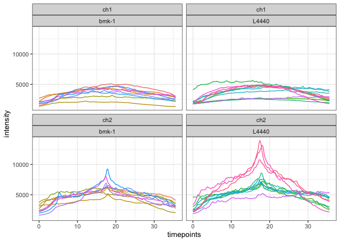
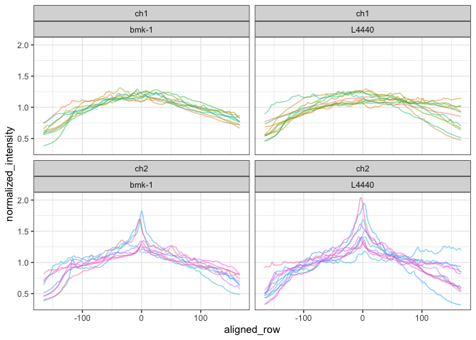
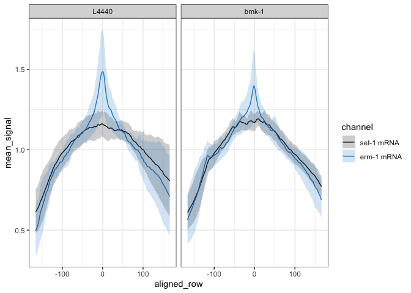
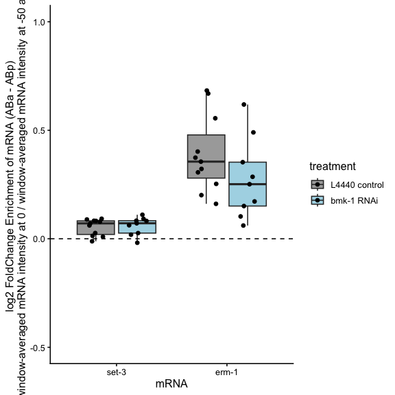
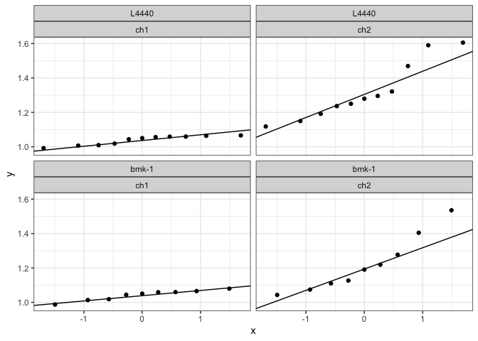

4-cell bmk1 KD ABa-ABp membrane erm-1
================
Sam Zavislan-Pullaro, Erin Osborn-Nishimura
2026-09-16

- [Overview](#overview)
- [load libraries](#load-libraries)
- [Import the data that was outputted from the new
  macro:](#import-the-data-that-was-outputted-from-the-new-macro)
- [Create annotation columns](#create-annotation-columns)
- [Fixed coordinate method](#fixed-coordinate-method)
- [Generate .csv of max intensities for erm-1 in bmk-1 KD and L4440
  control](#generate-csv-of-max-intensities-for-erm-1-in-bmk-1-kd-and-l4440-control)
- [re-arrange the dataset and calculate the
  means](#re-arrange-the-dataset-and-calculate-the-means)
- [Visualize how normalization is affecting
  y-axis](#visualize-how-normalization-is-affecting-y-axis)
- [Create a metric of “membrane-y-ness” for each
  condition](#create-a-metric-of-membrane-y-ness-for-each-condition)
- [Get summary stats for log2 fold change enrichment at membrane vs
  flanking
  regions](#get-summary-stats-for-log2-fold-change-enrichment-at-membrane-vs-flanking-regions)
- [Calculate the statistics](#calculate-the-statistics)
- [Window-based “membrane-y-ness” (alternative to single-point
  fc_enrich)](#window-based-membrane-y-ness-alternative-to-single-point-fc_enrich)
  - [Calculate the window-based
    ratio](#calculate-the-window-based-ratio)
  - [Plot the window-based
    enrichment](#plot-the-window-based-enrichment)
  - [Summary stats](#summary-stats)
  - [Check assumptions](#check-assumptions)
  - [Statistics](#statistics)
- [Export plots and stats](#export-plots-and-stats)
- [Session info](#session-info)

## Overview

This analysis compares the log2 fold enrichment of erm-1 at the ABa -
ABp during the 4-cell stage of embryonic development in C. elegans.

Empty vector RNAi control = L4440

RNAi knockdown condition = bmk-1

## load libraries

``` r
library(tidyverse)
library(gridExtra)
library(data.table)
library(rstatix)
library(dplyr)
```

## Import the data that was outputted from the new macro:

Note:

channel 1 = set-3

channel 2 = erm-1

``` r
# import the control data
# control data comes from L4440 empty vector RNAi controls 

# ABa - ABp 
control_1 <- read.table(file = "../01_input/2026-7-11_1324_datafile_for_231107_LP306_L4440.txt", header = FALSE, sep = "\t")
control_2 <- read.table(file = "../01_input/2026-7-11_1252_datafile_for_230713_L4440_RNAi_rep1.txt", header = FALSE, sep = "\t")
control_3 <- read.table(file = "../01_input/2026-7-11_133_datafile_for_230828_L4440_RNAi_rep2.txt", header = FALSE, sep = "\t")
control_4 <- read.table(file = "../01_input/2026-7-11_1337_datafile_for_240122_LP306_L4440-rep3.txt", header = FALSE, sep = "\t")


# import RNAi treatment data 
test_1 <- read.table(file = "../01_input/2026-7-14_126_datafile_for_220719_LP306_bmk-1_RNAi.txt", header = FALSE, sep = "\t")
test_2 <- read.table(file = "../01_input/2026-7-14_1216_datafile_for_230408_LP306_BMK-1_rep1.txt", header = FALSE, sep = "\t")
test_3 <- read.table(file = "../01_input/2026-7-14_1222_datafile_for_231107_LP306_BMK-1_rep2.txt", header = FALSE, sep = "\t")
test_4 <- read.table(file = "../01_input/2026-7-14_1225_datafile_for_231113_LP306_BMK-1_rep3.txt", header = FALSE, sep = "\t")

# test its dimensions
#dim(control_1)
#dim(control_2)
#dim(test_1)
#dim(test_2)
#dim(test_3)
#dim(test_4)

# Rename the column names
col_times <- paste(rep(1:333), sep = "")
colnames(control_1) <- c("file", "channel", col_times)
colnames(control_2) <- c("file", "channel", col_times)
colnames(control_3) <- c("file", "channel", col_times)
colnames(control_4) <- c("file", "channel", col_times)

colnames(test_1) <- c("file", "channel", col_times)
colnames(test_2) <- c("file", "channel", col_times)
colnames(test_3) <- c("file", "channel", col_times)
colnames(test_4) <- c("file", "channel", col_times)

# Check that the dimensions remain unchanged
dim(control_1)
```

    ## [1]   3 337

``` r
dim(control_2)
```

    ## [1]   7 337

``` r
dim(control_3)
```

    ## [1]   9 337

``` r
dim(control_4)
```

    ## [1]   7 337

``` r
dim(test_1)
```

    ## [1]   7 337

``` r
dim(test_2)
```

    ## [1]   5 337

``` r
dim(test_3)
```

    ## [1]   7 337

``` r
dim(test_4)
```

    ## [1]   3 337

``` r
# control_1[1:9,1:8]
# control_2[1:9,1:8]
# control_3[1:9,1:8]

# test_1[1:9,1:8]
# test_2[1:9,1:8]
# test_3[1:9,1:8]
# test_4[1:9,1:8]
```

## Create annotation columns

``` r
# Extract out the salient information from the filename and pivot the data longer
# Had to manually change image names to follow convention/consistency (date_strain_treatment_ID_R3D.dv)

control_1_exp <- control_1[2:dim(control_1)[1],1:335] %>%
  separate_wider_delim(file, delim = "_", names = c("date", "strain", "treatment", "embryoID", NA)) %>%
  pivot_longer(cols = `1`:`333`, names_to = "xpoint", values_to = "intensity") %>%
  mutate(unique_id = paste(date, strain, treatment, embryoID, channel, sep = "_"))
 
control_2_exp <- control_2[2:dim(control_2)[1],1:335] %>%
  separate_wider_delim(file, delim = "_", names = c("date", "strain", "treatment", "embryoID", NA)) %>%
  pivot_longer(cols = `1`:`333`, names_to = "xpoint", values_to = "intensity") %>%
  mutate(unique_id = paste(date, strain, treatment, embryoID, channel, sep = "_"))
 
control_3_exp <- control_3[2:dim(control_3)[1],1:335] %>%
  separate_wider_delim(file, delim = "_", names = c("date", "strain", "treatment", "embryoID", NA)) %>%
  pivot_longer(cols = `1`:`333`, names_to = "xpoint", values_to = "intensity") %>%
  mutate(unique_id = paste(date, strain, treatment, embryoID, channel, sep = "_")) 

control_4_exp <- control_4[2:dim(control_4)[1],1:335] %>%
  separate_wider_delim(file, delim = "_", names = c("date", "strain", "treatment", "embryoID", NA)) %>%
  pivot_longer(cols = `1`:`333`, names_to = "xpoint", values_to = "intensity") %>%
  mutate(unique_id = paste(date, strain, treatment, embryoID, channel, sep = "_")) 

 
test_1_exp <- test_1[2:dim(test_1)[1],1:335] %>%
  separate_wider_delim(file, delim = "_", names = c("date", "strain", "treatment", "embryoID", NA)) %>%
  pivot_longer(cols = `1`:`333`, names_to = "xpoint", values_to = "intensity") %>%
  mutate(unique_id = paste(date, strain, treatment, embryoID, channel, sep = "_"))

test_2_exp <- test_2[2:dim(test_2)[1],1:335] %>%
  separate_wider_delim(file, delim = "_", names = c("date", "strain", "treatment", "embryoID", NA)) %>%
  pivot_longer(cols = `1`:`333`, names_to = "xpoint", values_to = "intensity") %>%
  mutate(unique_id = paste(date, strain, treatment, embryoID, channel, sep = "_"))

test_3_exp <- test_3[2:dim(test_3)[1],1:335] %>%
  separate_wider_delim(file, delim = "_", names = c("date", "strain", "treatment", "embryoID", NA)) %>%
  pivot_longer(cols = `1`:`333`, names_to = "xpoint", values_to = "intensity") %>%
  mutate(unique_id = paste(date, strain, treatment, embryoID, channel, sep = "_"))

test_4_exp <- test_4[2:dim(test_4)[1],1:335] %>%
  separate_wider_delim(file, delim = "_", names = c("date", "strain", "treatment", "embryoID", NA)) %>%
  pivot_longer(cols = `1`:`333`, names_to = "xpoint", values_to = "intensity") %>%
  mutate(unique_id = paste(date, strain, treatment, embryoID, channel, sep = "_"))
```

``` r
# Add in the timepoints

addInTimepoints <- function(tibble) {
  timepoints <- as.vector(unlist(control_1[1,3:335]))
  repnumb = dim(tibble)[1]/333
  tibble::add_column(tibble, timepoints = rep(timepoints,repnumb), .after = "xpoint")
}

control_1_plustime <- addInTimepoints(control_1_exp)
control_2_plustime <- addInTimepoints(control_2_exp)
control_3_plustime <- addInTimepoints(control_3_exp)
control_4_plustime <- addInTimepoints(control_4_exp)

test_1_plustime <- addInTimepoints(test_1_exp)
test_2_plustime <- addInTimepoints(test_2_exp)
test_3_plustime <- addInTimepoints(test_3_exp)
test_4_plustime <- addInTimepoints(test_4_exp)

#check it
control_1_plustime[330:340,]
```

    ## # A tibble: 11 × 9
    ##    date  strain treatment embryoID channel xpoint timepoints intensity unique_id
    ##    <chr> <chr>  <chr>     <chr>    <chr>   <chr>       <dbl>     <dbl> <chr>    
    ##  1 2311… LP306  L4440     02       ch2     330        35.3       5397. 231107_L…
    ##  2 2311… LP306  L4440     02       ch2     331        35.4       5379. 231107_L…
    ##  3 2311… LP306  L4440     02       ch2     332        35.5       5311. 231107_L…
    ##  4 2311… LP306  L4440     02       ch2     333        35.6       5247. 231107_L…
    ##  5 2311… LP306  L4440     02       ch1     1           0         1781. 231107_L…
    ##  6 2311… LP306  L4440     02       ch1     2           0.107     1786. 231107_L…
    ##  7 2311… LP306  L4440     02       ch1     3           0.214     1791. 231107_L…
    ##  8 2311… LP306  L4440     02       ch1     4           0.322     1794. 231107_L…
    ##  9 2311… LP306  L4440     02       ch1     5           0.429     1799. 231107_L…
    ## 10 2311… LP306  L4440     02       ch1     6           0.536     1801. 231107_L…
    ## 11 2311… LP306  L4440     02       ch1     7           0.643     1805. 231107_L…

``` r
control_2_plustime[330:340,]
```

    ## # A tibble: 11 × 9
    ##    date  strain treatment embryoID channel xpoint timepoints intensity unique_id
    ##    <chr> <chr>  <chr>     <chr>    <chr>   <chr>       <dbl>     <dbl> <chr>    
    ##  1 2307… LP306  L4440     05       ch2     330        35.3       2600. 230713_L…
    ##  2 2307… LP306  L4440     05       ch2     331        35.4       2568. 230713_L…
    ##  3 2307… LP306  L4440     05       ch2     332        35.5       2539. 230713_L…
    ##  4 2307… LP306  L4440     05       ch2     333        35.6       2510. 230713_L…
    ##  5 2307… LP306  L4440     05       ch1     1           0         2068. 230713_L…
    ##  6 2307… LP306  L4440     05       ch1     2           0.107     2080. 230713_L…
    ##  7 2307… LP306  L4440     05       ch1     3           0.214     2094. 230713_L…
    ##  8 2307… LP306  L4440     05       ch1     4           0.322     2104. 230713_L…
    ##  9 2307… LP306  L4440     05       ch1     5           0.429     2116. 230713_L…
    ## 10 2307… LP306  L4440     05       ch1     6           0.536     2129. 230713_L…
    ## 11 2307… LP306  L4440     05       ch1     7           0.643     2143. 230713_L…

``` r
control_3_plustime[330:340,]
```

    ## # A tibble: 11 × 9
    ##    date  strain treatment embryoID channel xpoint timepoints intensity unique_id
    ##    <chr> <chr>  <chr>     <chr>    <chr>   <chr>       <dbl>     <dbl> <chr>    
    ##  1 2308… LP306  L4440     01       ch2     330        35.3       3083. 230828_L…
    ##  2 2308… LP306  L4440     01       ch2     331        35.4       3057. 230828_L…
    ##  3 2308… LP306  L4440     01       ch2     332        35.5       3033. 230828_L…
    ##  4 2308… LP306  L4440     01       ch2     333        35.6       3018. 230828_L…
    ##  5 2308… LP306  L4440     01       ch1     1           0         1778. 230828_L…
    ##  6 2308… LP306  L4440     01       ch1     2           0.107     1781. 230828_L…
    ##  7 2308… LP306  L4440     01       ch1     3           0.214     1790. 230828_L…
    ##  8 2308… LP306  L4440     01       ch1     4           0.322     1795. 230828_L…
    ##  9 2308… LP306  L4440     01       ch1     5           0.429     1800. 230828_L…
    ## 10 2308… LP306  L4440     01       ch1     6           0.536     1811. 230828_L…
    ## 11 2308… LP306  L4440     01       ch1     7           0.643     1815. 230828_L…

``` r
control_4_plustime[330:340,]
```

    ## # A tibble: 11 × 9
    ##    date  strain treatment embryoID channel xpoint timepoints intensity unique_id
    ##    <chr> <chr>  <chr>     <chr>    <chr>   <chr>       <dbl>     <dbl> <chr>    
    ##  1 2401… LP306  L4440     02       ch2     330        35.3       2189. 240122_L…
    ##  2 2401… LP306  L4440     02       ch2     331        35.4       2187. 240122_L…
    ##  3 2401… LP306  L4440     02       ch2     332        35.5       2181. 240122_L…
    ##  4 2401… LP306  L4440     02       ch2     333        35.6       2158. 240122_L…
    ##  5 2401… LP306  L4440     02       ch1     1           0         2156. 240122_L…
    ##  6 2401… LP306  L4440     02       ch1     2           0.107     2185. 240122_L…
    ##  7 2401… LP306  L4440     02       ch1     3           0.214     2213. 240122_L…
    ##  8 2401… LP306  L4440     02       ch1     4           0.322     2251. 240122_L…
    ##  9 2401… LP306  L4440     02       ch1     5           0.429     2277. 240122_L…
    ## 10 2401… LP306  L4440     02       ch1     6           0.536     2310. 240122_L…
    ## 11 2401… LP306  L4440     02       ch1     7           0.643     2347. 240122_L…

``` r
test_1_plustime[330:340,]
```

    ## # A tibble: 11 × 9
    ##    date  strain treatment embryoID channel xpoint timepoints intensity unique_id
    ##    <chr> <chr>  <chr>     <chr>    <chr>   <chr>       <dbl>     <dbl> <chr>    
    ##  1 2207… LP306  bmk-1     07       ch2     330        35.3       4204. 220719_L…
    ##  2 2207… LP306  bmk-1     07       ch2     331        35.4       4164. 220719_L…
    ##  3 2207… LP306  bmk-1     07       ch2     332        35.5       4137. 220719_L…
    ##  4 2207… LP306  bmk-1     07       ch2     333        35.6       4110. 220719_L…
    ##  5 2207… LP306  bmk-1     07       ch1     1           0         1553. 220719_L…
    ##  6 2207… LP306  bmk-1     07       ch1     2           0.107     1564. 220719_L…
    ##  7 2207… LP306  bmk-1     07       ch1     3           0.214     1573. 220719_L…
    ##  8 2207… LP306  bmk-1     07       ch1     4           0.322     1582. 220719_L…
    ##  9 2207… LP306  bmk-1     07       ch1     5           0.429     1593. 220719_L…
    ## 10 2207… LP306  bmk-1     07       ch1     6           0.536     1607. 220719_L…
    ## 11 2207… LP306  bmk-1     07       ch1     7           0.643     1617. 220719_L…

``` r
test_2_plustime[330:340,]
```

    ## # A tibble: 11 × 9
    ##    date  strain treatment embryoID channel xpoint timepoints intensity unique_id
    ##    <chr> <chr>  <chr>     <chr>    <chr>   <chr>       <dbl>     <dbl> <chr>    
    ##  1 2304… LP306  bmk-1     02       ch2     330        35.3       2086. 230408_L…
    ##  2 2304… LP306  bmk-1     02       ch2     331        35.4       2072. 230408_L…
    ##  3 2304… LP306  bmk-1     02       ch2     332        35.5       2051. 230408_L…
    ##  4 2304… LP306  bmk-1     02       ch2     333        35.6       2026. 230408_L…
    ##  5 2304… LP306  bmk-1     02       ch1     1           0         1387. 230408_L…
    ##  6 2304… LP306  bmk-1     02       ch1     2           0.107     1397. 230408_L…
    ##  7 2304… LP306  bmk-1     02       ch1     3           0.214     1407. 230408_L…
    ##  8 2304… LP306  bmk-1     02       ch1     4           0.322     1418. 230408_L…
    ##  9 2304… LP306  bmk-1     02       ch1     5           0.429     1427. 230408_L…
    ## 10 2304… LP306  bmk-1     02       ch1     6           0.536     1439. 230408_L…
    ## 11 2304… LP306  bmk-1     02       ch1     7           0.643     1452. 230408_L…

``` r
test_3_plustime[330:340,]
```

    ## # A tibble: 11 × 9
    ##    date  strain treatment embryoID channel xpoint timepoints intensity unique_id
    ##    <chr> <chr>  <chr>     <chr>    <chr>   <chr>       <dbl>     <dbl> <chr>    
    ##  1 2311… LP306  bmk-1     03       ch2     330        35.3       3378. 231107_L…
    ##  2 2311… LP306  bmk-1     03       ch2     331        35.4       3301. 231107_L…
    ##  3 2311… LP306  bmk-1     03       ch2     332        35.5       3211. 231107_L…
    ##  4 2311… LP306  bmk-1     03       ch2     333        35.6       3131. 231107_L…
    ##  5 2311… LP306  bmk-1     03       ch1     1           0         1896. 231107_L…
    ##  6 2311… LP306  bmk-1     03       ch1     2           0.107     1902. 231107_L…
    ##  7 2311… LP306  bmk-1     03       ch1     3           0.214     1903. 231107_L…
    ##  8 2311… LP306  bmk-1     03       ch1     4           0.322     1910. 231107_L…
    ##  9 2311… LP306  bmk-1     03       ch1     5           0.429     1916. 231107_L…
    ## 10 2311… LP306  bmk-1     03       ch1     6           0.536     1923. 231107_L…
    ## 11 2311… LP306  bmk-1     03       ch1     7           0.643     1927. 231107_L…

``` r
test_4_plustime[330:340,]
```

    ## # A tibble: 11 × 9
    ##    date  strain treatment embryoID channel xpoint timepoints intensity unique_id
    ##    <chr> <chr>  <chr>     <chr>    <chr>   <chr>       <dbl>     <dbl> <chr>    
    ##  1 2311… LP306  bmk-1     02       ch2     330        35.3       3170. 231113_L…
    ##  2 2311… LP306  bmk-1     02       ch2     331        35.4       3142. 231113_L…
    ##  3 2311… LP306  bmk-1     02       ch2     332        35.5       3116. 231113_L…
    ##  4 2311… LP306  bmk-1     02       ch2     333        35.6       3092. 231113_L…
    ##  5 2311… LP306  bmk-1     02       ch1     1           0         2159. 231113_L…
    ##  6 2311… LP306  bmk-1     02       ch1     2           0.107     2162. 231113_L…
    ##  7 2311… LP306  bmk-1     02       ch1     3           0.214     2166. 231113_L…
    ##  8 2311… LP306  bmk-1     02       ch1     4           0.322     2171. 231113_L…
    ##  9 2311… LP306  bmk-1     02       ch1     5           0.429     2181. 231113_L…
    ## 10 2311… LP306  bmk-1     02       ch1     6           0.536     2182. 231113_L…
    ## 11 2311… LP306  bmk-1     02       ch1     7           0.643     2189. 231113_L…

``` r
# Merge the datasets together 
bmk1_RNAi_data_total <- rbind(control_1_plustime, control_2_plustime, control_3_plustime, control_4_plustime, test_1_plustime, test_2_plustime, test_3_plustime, test_4_plustime)

head(bmk1_RNAi_data_total)
```

    ## # A tibble: 6 × 9
    ##   date   strain treatment embryoID channel xpoint timepoints intensity unique_id
    ##   <chr>  <chr>  <chr>     <chr>    <chr>   <chr>       <dbl>     <dbl> <chr>    
    ## 1 231107 LP306  L4440     02       ch2     1           0         1878. 231107_L…
    ## 2 231107 LP306  L4440     02       ch2     2           0.107     1894. 231107_L…
    ## 3 231107 LP306  L4440     02       ch2     3           0.214     1914. 231107_L…
    ## 4 231107 LP306  L4440     02       ch2     4           0.322     1929. 231107_L…
    ## 5 231107 LP306  L4440     02       ch2     5           0.429     1949. 231107_L…
    ## 6 231107 LP306  L4440     02       ch2     6           0.536     1970. 231107_L…

``` r
# Plot all samples
ggplot(data = bmk1_RNAi_data_total, aes(x = timepoints, y = intensity, group = c(unique_id))) +
  geom_line(aes(colour = unique_id))+
  facet_wrap(~ channel + treatment)+
  guides(color = "none")+
  theme_bw()
```

<!-- -->

## Fixed coordinate method

Peak intensity alignment is not used in this analysis. Aligning each
embryo to its own observed channel-2 peak risks manufacturing apparent
enrichment at the alignment point. Instead, every embryo uses the same
fixed coordinate system based on its row position (`xpoint`), recentered
so it spans the same `-166:166` range. Position 0 is the center of the
ROI box from the FIJI macro quantification script. The center of the ROI
box was manually aligned to the membrane, using a PH::GFP membrane
marker strain to visualize the membrane.

``` r
bmk1_dt <- as.data.table(bmk1_RNAi_data_total)
bmk1_dt$xpoint <- as.integer(bmk1_dt$xpoint)

# Fixed coordinate: recenter xpoint (1:333) to run -166:166, identical for
# every embryo and every channel - no peak-finding, no per-embryo offset.
bmk1_dt[, aligned_row := xpoint - 167]

# Check that everything worked
dim(bmk1_RNAi_data_total)
```

    ## [1] 13320     9

``` r
dim(bmk1_dt)
```

    ## [1] 13320    10

``` r
range(bmk1_dt$aligned_row)
```

    ## [1] -166  166

``` r
# Rename to match the variable name the rest of the script expects
total_align_long <- bmk1_dt %>%
  select(strain, aligned_row, unique_id, intensity)
```

``` r
# Data-completeness check: for each position in the fixed coordinate
# (aligned_row, -166:166), count total observations and how many are NA.
# Every embryo covers the full -166:166 range with real values, so
# pct_na should be 0 throughout. Non-zero values would flag missing
# data in the raw macro output.

total_align_long %>%
  group_by(aligned_row) %>%
  summarize(
    n_total = n(),
    n_na = sum(is.na(intensity)),
    pct_na = mean(is.na(intensity)) * 100
  ) %>%
  arrange(aligned_row) %>%
  head()
```

    ## # A tibble: 6 × 4
    ##   aligned_row n_total  n_na pct_na
    ##         <dbl>   <int> <int>  <dbl>
    ## 1        -166      40     0      0
    ## 2        -165      40     0      0
    ## 3        -164      40     0      0
    ## 4        -163      40     0      0
    ## 5        -162      40     0      0
    ## 6        -161      40     0      0

## Generate .csv of max intensities for erm-1 in bmk-1 KD and L4440 control

End of script: saves and exports to ../03_output directory

``` r
max_intensities <- total_align_long %>%
  filter(!grepl("ch1", unique_id)) %>% # filter out rows that contain set-3 in ch1
  group_by(unique_id) %>%
  slice_max(intensity, n = 1, with_ties = FALSE)
```

## re-arrange the dataset and calculate the means

``` r
# Normalize the data by dividing by the embryo-specific mean
bmk1_norm_total <- total_align_long %>%
  separate_wider_delim(unique_id, delim = "_", names = c("date", NA, "treatment", "embryoID", "channel")) %>%
  group_by(date, embryoID, channel, treatment) %>%
  mutate(normalized_intensity = intensity / mean(intensity, na.rm = TRUE))
table(bmk1_norm_total$channel, bmk1_norm_total$treatment)
```

    ##      
    ##       bmk-1 L4440
    ##   ch1  2997  3663
    ##   ch2  2997  3663

``` r
head(bmk1_norm_total)
```

    ## # A tibble: 6 × 8
    ## # Groups:   date, embryoID, channel, treatment [1]
    ##   strain aligned_row date   treatment embryoID channel intensity
    ##   <chr>        <dbl> <chr>  <chr>     <chr>    <chr>       <dbl>
    ## 1 LP306         -166 231107 L4440     02       ch2         1878.
    ## 2 LP306         -165 231107 L4440     02       ch2         1894.
    ## 3 LP306         -164 231107 L4440     02       ch2         1914.
    ## 4 LP306         -163 231107 L4440     02       ch2         1929.
    ## 5 LP306         -162 231107 L4440     02       ch2         1949.
    ## 6 LP306         -161 231107 L4440     02       ch2         1970.
    ## # ℹ 1 more variable: normalized_intensity <dbl>

## Visualize how normalization is affecting y-axis

``` r
normalized_linescan <- ggplot(data = bmk1_norm_total, aes(x = aligned_row, y = normalized_intensity, 
                                     group = interaction(date, embryoID, channel))) +
  geom_line(aes(color = interaction(date, embryoID, channel)), alpha = 0.5) +
  facet_wrap(~ channel + treatment) +
  guides(color = "none") +
  theme_bw()

normalized_linescan
```

<!-- -->

``` r
# Separate out the unique identifier info, then pivot sider
bmk1_wide_by_sample <- bmk1_norm_total %>%
  pivot_wider(names_from = c(date, embryoID, channel, treatment), 
            values_from = normalized_intensity,
            id_cols = c(strain, aligned_row))


# Second Try - Separate out the unique identifier info, then pivot sider
bmk1_wide_by_sample <- bmk1_norm_total %>%
  pivot_wider(names_from = c(date, embryoID), 
            values_from = normalized_intensity,
            id_cols = c(strain, aligned_row, treatment, channel))

colnames(bmk1_wide_by_sample)
```

    ##  [1] "strain"      "aligned_row" "treatment"   "channel"     "231107_02"  
    ##  [6] "230713_05"   "230713_07"   "230713_11"   "230828_01"   "230828_02"  
    ## [11] "230828_04"   "230828_06"   "240122_02"   "240122_05"   "240122_10"  
    ## [16] "220719_07"   "220719_08"   "220719_12"   "230408_02"   "230408_05"  
    ## [21] "231107_03"   "231107_05"   "231107_13"   "231113_02"

``` r
# Play around with mean, medium, and sum:
bmk1_wide_with_stats <- bmk1_wide_by_sample %>%
  rowwise() %>%
  mutate(
    sum_signal    = sum(c_across(`231107_02`:`231113_02`), na.rm = TRUE),
    mean_signal   = mean(c_across(`231107_02`:`231113_02`), na.rm = TRUE),
    median_signal = median(c_across(`231107_02`:`231113_02`), na.rm = TRUE),
    sd_signal     = sd(c_across(`231107_02`:`231113_02`), na.rm = TRUE)
  ) %>%
  ungroup()

# colnames(bmk1_wide_with_stats)

bmk1_wide_with_range <- bmk1_wide_with_stats %>%
  rowwise() %>%
  mutate(ymeanmax = sum(mean_signal, sd_signal) ) %>%
  mutate(ymeanmin = sum(mean_signal, -sd_signal)) %>%
  ungroup() %>%
  mutate(treatment = factor(treatment, levels = c("L4440", "bmk-1")))

colorselection = c("#000000", "#2189ce")

# Plot split by RNAi treatment and L4440 empty vector control 
a <- ggplot(data = bmk1_wide_with_range, aes(x = aligned_row, y = mean_signal, group = interaction(channel, treatment)))+
  geom_line(aes(color=channel))+
  scale_color_manual(values = colorselection, aesthetics = c("colour", "fill"), labels = c("set-1 mRNA", "erm-1 mRNA"))+
  geom_ribbon(aes(ymin = ymeanmin, ymax = ymeanmax, fill=channel), alpha = 0.2, ) +
  facet_wrap(~ treatment)+
  theme_bw()

a
```

<!-- -->

``` r
# Plot in a different way - set-3 and erm-1 mRNA split into facets
colorselection = c("#2189ce", "#000000")
channel.labs <- c("set-3 mRNA", "erm-1 mRNA")
names(channel.labs) <- c("ch1", "ch2")

# Plot split by transcript
b <- ggplot(data = bmk1_wide_with_range, aes(x = aligned_row, y = mean_signal, group = interaction(channel, treatment)))+
  geom_line(aes(color=treatment))+
  scale_color_manual(values = colorselection, aesthetics = c("colour", "fill"), labels = c("control", "bmk-1 RNAi"))+
  geom_ribbon(aes(ymin = ymeanmin, ymax = ymeanmax, fill=treatment), alpha = 0.2, ) +
  facet_wrap(~ channel, labeller = labeller(channel = channel.labs))+
  theme_bw()
```

## Create a metric of “membrane-y-ness” for each condition

We are comparing the log2 fold change intensity at the membrane to the
flanking regions along the anterior to posterior axis

For 2-cell stage, we used the range: -100,0,100

For 4-cell stage, use -50,0,50 range because the cells are smaller, and
the orientation of the membrane can push the ROI quantification box
outside of the embryo.

``` r
# # extract the peak intensity versus the -50 and +50 values
# peaks_and_valleys <- bmk1_norm_total %>%
#   filter(aligned_row %in% c(-50,0,50))
# 
# # Nest the -50, 0, and +50 values
# nest_pandv <- peaks_and_valleys %>%
#   group_by(date, treatment, embryoID, channel) %>%
#   nest()
# 
# # A function to calculate the ratio of the value at 0 compared to the mean of positions, -50 and +50
# my_calc2 <- function(df) {
#   df$normalized_intensity[2] / mean(c(df$normalized_intensity[1], df$normalized_intensity[3]))
# }
# 
# # Calculate the ratio for each datapoint
# foldChange_calc <- nest_pandv %>%
#   mutate(fc_enrich = map_dbl(data, my_calc2))
# 
# # Change some columns to factors
# foldChange_calc$treatment <- factor(foldChange_calc$treatment, levels = c("L4440", "bmk-1")) 
# foldChange_calc$channel <- as.factor(foldChange_calc$channel)
# 
# 
# # plot the data:
# d <- ggplot(data = foldChange_calc, aes(x = as.factor(channel), y = log(fc_enrich, base = 2), fill = treatment))+
#   geom_boxplot(outlier.shape = NA)+
#   geom_jitter(position=position_jitterdodge())+
#   scale_y_continuous(limits = c(-0.5, 1.0)) +
#   geom_hline(yintercept = 0, linetype = "dashed") +
#   scale_fill_manual(values = c("L4440" = "darkgray", "bmk-1" = "lightblue"),
#                    labels = c("L4440" = "L4440 control", "bmk-1" = "bmk-1 RNAi"))+labs(y = "log2 FoldChange Enrichment of mRNA (ABa - ABp) \n(mRNA intensity at 0 / mean mRNA intensity at -50 and 50)", x = "mRNA") +
#   scale_x_discrete(labels = c("ch1" = "set-3", "ch2" = "erm-1"))+
#   theme_classic(base_size = 12)
# 
# d
# 
# e <- ggplot(data = foldChange_calc, aes(x = as.factor(treatment), y = log(fc_enrich, base = 2), fill = channel))+
#   geom_boxplot(outlier.shape = NA)+
#   geom_jitter(position=position_jitterdodge())+
#   scale_y_continuous(limits = c(-0.5, 1.0)) +
#   geom_hline(yintercept = 0, linetype = "dashed") +
#   labs(y = "log2 FoldChange Enrichment of mRNA (ABa - ABp) \n(mRNA intensity at 0 / mean mRNA intensity at -50 and 50)", x = "mRNA") +
#   theme_classic(base_size = 12)
```

## Get summary stats for log2 fold change enrichment at membrane vs flanking regions

``` r
# foldChange_calc %>%
#   group_by(treatment, channel) %>%
#   summarise(
#     min_log2fc    = min(log(fc_enrich, base = 2), na.rm = TRUE),
#     median_log2fc = median(log(fc_enrich, base = 2), na.rm = TRUE),
#     mean_log2fc   = mean(log(fc_enrich, base = 2), na.rm = TRUE),
#     max_log2fc    = max(log(fc_enrich, base = 2), na.rm = TRUE)
#   )
```

## Calculate the statistics

Check assumptions:

1)  Normality (Shapiro test, QQ plots)
2)  Homogeneity of variance Levene’s test)

``` r
# # Check normality 
# 
# foldChange_calc %>%
#   group_by(treatment, channel) %>%
#   shapiro_test(fc_enrich)
# 
# # QQ plots to visualize normality
# ggplot(foldChange_calc, aes(sample = fc_enrich)) +
#   stat_qq() +
#   stat_qq_line() +
#   facet_wrap(~ treatment + channel) +
#   theme_bw()
```

``` r
# # Homogeneity of variance across treatment groups, within each channel
# 
# foldChange_calc %>%
#   group_by(channel) %>%
#   levene_test(fc_enrich ~ treatment)
```

Wilcoxon test

``` r
# foldChange_calc
# 
# stats_wilcox <- foldChange_calc %>%
#   group_by(channel) %>%
#   wilcox_test(fc_enrich ~ treatment) %>%
#   adjust_pvalue(method = "BH") %>%
#   add_significance()
# 
# stats_wilcox
```

Welch test with equal variance = TRUE

``` r
# ### Passes normality and equal variance tests 
# ### Standard t test with var.equal = TRUE is appropriate 
# 
# stats_ttest <- foldChange_calc %>%
#   group_by(channel) %>%
#   t_test(fc_enrich ~ treatment, var.equal = TRUE) %>%
#   group_by(channel) %>%
#   adjust_pvalue(method = "BH") %>%
#   add_significance()
# stats_ttest
```

------------------------------------------------------------------------

## Window-based “membrane-y-ness” (alternative to single-point fc_enrich)

The metric above (`fc_enrich`) reads a single row for the peak
(`aligned_row == 0`) and single rows for the flanks (`-50`, `50`), so
it’s sensitive to noise at exactly those three coordinates. This section
averages over a small window around each of those points instead, which
should be less sensitive to single-pixel noise while staying directly
comparable to `fc_enrich` above.

### Calculate the window-based ratio

``` r
window_half_width <- 5  # rows to either side of each point

peak_flank_windows <- bmk1_norm_total %>%
  mutate(region = case_when(
    aligned_row >= -window_half_width & aligned_row <= window_half_width ~ "peak",
    aligned_row >= -50 - window_half_width & aligned_row <= -50 + window_half_width ~ "flank",
    aligned_row >=  50 - window_half_width & aligned_row <=  50 + window_half_width ~ "flank",
    TRUE ~ NA_character_
  )) %>%
  filter(!is.na(region))

fc_window <- peak_flank_windows %>%
  group_by(date, treatment, embryoID, channel, region) %>%
  summarise(mean_intensity = mean(normalized_intensity, na.rm = TRUE), .groups = "drop") %>%
  pivot_wider(names_from = region, values_from = mean_intensity) %>%
  mutate(fc_enrich_window = peak / flank,
         log2_fc_window = log2(fc_enrich_window))
```

### Plot the window-based enrichment

``` r
fc_window$treatment <- factor(fc_window$treatment, levels = c("L4440", "bmk-1"))

d_window <- ggplot(data = fc_window, aes(x = as.factor(channel), y = log2_fc_window, fill = treatment))+
  geom_boxplot(outlier.shape = NA)+
  geom_jitter(position=position_jitterdodge())+
  scale_y_continuous(limits = c(-0.5, 1.0)) +
  geom_hline(yintercept = 0, linetype = "dashed") +
  scale_fill_manual(values = c("L4440" = "darkgray", "bmk-1" = "lightblue"),
                   labels = c("L4440" = "L4440 control", "bmk-1" = "bmk-1 RNAi"))+
  labs(y = "log2 FoldChange Enrichment of mRNA (ABa - ABp) \n(window-averaged mRNA intensity at 0 / window-averaged mRNA intensity at -50 and 50)", x = "mRNA") +
  scale_x_discrete(labels = c("ch1" = "set-3", "ch2" = "erm-1"))+
  theme_classic(base_size = 12)

d_window
```

<!-- -->

### Summary stats

``` r
window_summary_stats <- fc_window %>%
  group_by(treatment, channel) %>%
  summarise(
    min_log2fc    = min(log2_fc_window, na.rm = TRUE),
    median_log2fc = median(log2_fc_window, na.rm = TRUE),
    mean_log2fc   = mean(log2_fc_window, na.rm = TRUE),
    max_log2fc    = max(log2_fc_window, na.rm = TRUE)
  )

window_summary_stats
```

    ## # A tibble: 4 × 6
    ## # Groups:   treatment [2]
    ##   treatment channel min_log2fc median_log2fc mean_log2fc max_log2fc
    ##   <fct>     <chr>        <dbl>         <dbl>       <dbl>      <dbl>
    ## 1 L4440     ch1        -0.0115        0.0710      0.0542     0.0924
    ## 2 L4440     ch2         0.161         0.355       0.389      0.683 
    ## 3 bmk-1     ch1        -0.0182        0.0715      0.0588     0.111 
    ## 4 bmk-1     ch2         0.0611        0.252       0.276      0.619

### Check assumptions

``` r
# Normality
fc_window %>%
  group_by(treatment, channel) %>%
  shapiro_test(fc_enrich_window)
```

    ## # A tibble: 4 × 5
    ##   treatment channel variable         statistic      p
    ##   <fct>     <chr>   <chr>                <dbl>  <dbl>
    ## 1 L4440     ch1     fc_enrich_window     0.859 0.0567
    ## 2 L4440     ch2     fc_enrich_window     0.891 0.145 
    ## 3 bmk-1     ch1     fc_enrich_window     0.932 0.501 
    ## 4 bmk-1     ch2     fc_enrich_window     0.912 0.333

``` r
ggplot(fc_window, aes(sample = fc_enrich_window)) +
  stat_qq() +
  stat_qq_line() +
  facet_wrap(~ treatment + channel) +
  theme_bw()
```

<!-- -->

``` r
# Homogeneity of variance
fc_window %>%
  group_by(channel) %>%
  levene_test(fc_enrich_window ~ treatment)
```

    ## # A tibble: 2 × 5
    ##   channel   df1   df2 statistic     p
    ##   <chr>   <int> <int>     <dbl> <dbl>
    ## 1 ch1         1    18  0.0138   0.908
    ## 2 ch2         1    18  0.000662 0.980

### Statistics

1)  Wilcoxon test

``` r
# 1) Wilcoxon test

stats_wilcox_window <- fc_window %>%
  group_by(channel) %>%
  wilcox_test(fc_enrich_window ~ treatment) %>%
  adjust_pvalue(method = "BH") %>%
  add_significance()

stats_wilcox_window
```

    ## # A tibble: 2 × 10
    ##   channel .y.       group1 group2    n1    n2 statistic     p p.adj p.adj.signif
    ##   <chr>   <chr>     <chr>  <chr>  <int> <int>     <dbl> <dbl> <dbl> <chr>       
    ## 1 ch1     fc_enric… L4440  bmk-1     11     9        44 0.71  0.71  ns          
    ## 2 ch2     fc_enric… L4440  bmk-1     11     9        71 0.112 0.224 ns

``` r
# 2) Welch t test with var.equal = TRUE 

stats_ttest_window <- fc_window %>%
  group_by(channel) %>%
  t_test(fc_enrich_window ~ treatment, var.equal = TRUE) %>%
  group_by(channel) %>%
  adjust_pvalue(method = "BH") %>%
  add_significance()

stats_ttest_window
```

    ## # A tibble: 2 × 11
    ##   channel .y.              group1 group2    n1    n2 statistic    df     p p.adj
    ##   <chr>   <chr>            <chr>  <chr>  <int> <int>     <dbl> <dbl> <dbl> <dbl>
    ## 1 ch1     fc_enrich_window L4440  bmk-1     11     9    -0.268    18 0.792 0.792
    ## 2 ch2     fc_enrich_window L4440  bmk-1     11     9     1.33     18 0.199 0.199
    ## # ℹ 1 more variable: p.adj.signif <chr>

------------------------------------------------------------------------

## Export plots and stats

``` r
today      <- format(Sys.Date(), "%y%m%d")
output_dir <- "../03_output"
dir.create(output_dir, showWarnings = FALSE, recursive = TRUE)

ggsave(file.path(output_dir, paste0(today, "_boxplot_window.svg")), plot = d_window,
       width = 6, height = 6)
ggsave(file.path(output_dir, paste0(today, "_linescan_individual.svg")), plot = normalized_linescan,
       width = 6, height = 6)
ggsave(file.path(output_dir, paste0(today, "_mean_signal_linscan.svg")), plot = a,
       width = 6, height = 6)

write_csv(window_summary_stats, file.path(output_dir, paste0(today, "_window_summary_stats.csv")))
write_csv(stats_wilcox_window, file.path(output_dir, paste0(today, "_wilcoxon_stats_window.csv")))
write_csv(stats_ttest_window, file.path(output_dir, paste0(today, "_ttest_stats_window.csv")))

cat("Exported to:", normalizePath(output_dir), "\n")
```

    ## Exported to: /Users/samzavislan/Desktop/onish/people/naly/projects/erm-1_LP306_RNAi/ERM1_TorresMangual_workingFolder/03_kinesins_KDs/02_bmk-1_RNAi_4-cell_ABa-ABp/03_output

## Session info

``` r
sessionInfo()
```

    ## R version 4.5.2 (2025-10-31)
    ## Platform: aarch64-apple-darwin20
    ## Running under: macOS Sequoia 15.4.1
    ## 
    ## Matrix products: default
    ## BLAS:   /System/Library/Frameworks/Accelerate.framework/Versions/A/Frameworks/vecLib.framework/Versions/A/libBLAS.dylib 
    ## LAPACK: /Library/Frameworks/R.framework/Versions/4.5-arm64/Resources/lib/libRlapack.dylib;  LAPACK version 3.12.1
    ## 
    ## locale:
    ## [1] en_US.UTF-8/en_US.UTF-8/en_US.UTF-8/C/en_US.UTF-8/en_US.UTF-8
    ## 
    ## time zone: America/Denver
    ## tzcode source: internal
    ## 
    ## attached base packages:
    ## [1] stats     graphics  grDevices utils     datasets  methods   base     
    ## 
    ## other attached packages:
    ##  [1] rstatix_0.7.3     data.table_1.18.4 gridExtra_2.3     lubridate_1.9.5  
    ##  [5] forcats_1.0.1     stringr_1.6.0     dplyr_1.2.0       purrr_1.2.1      
    ##  [9] readr_2.2.0       tidyr_1.3.2       tibble_3.3.1      ggplot2_4.0.2    
    ## [13] tidyverse_2.0.0  
    ## 
    ## loaded via a namespace (and not attached):
    ##  [1] utf8_1.2.6         generics_0.1.4     stringi_1.8.7      hms_1.1.4         
    ##  [5] digest_0.6.39      magrittr_2.0.4     evaluate_1.0.5     grid_4.5.2        
    ##  [9] timechange_0.4.0   RColorBrewer_1.1-3 fastmap_1.2.0      backports_1.5.0   
    ## [13] Formula_1.2-5      scales_1.4.0       textshaping_1.0.5  abind_1.4-8       
    ## [17] cli_3.6.5          crayon_1.5.3       rlang_1.1.7        bit64_4.6.0-1     
    ## [21] withr_3.0.2        yaml_2.3.12        parallel_4.5.2     tools_4.5.2       
    ## [25] tzdb_0.5.0         broom_1.0.12       vctrs_0.7.2        R6_2.6.1          
    ## [29] lifecycle_1.0.5    bit_4.6.0          car_3.1-5          vroom_1.7.0       
    ## [33] ragg_1.5.2         pkgconfig_2.0.3    pillar_1.11.1      gtable_0.3.6      
    ## [37] glue_1.8.0         systemfonts_1.3.2  xfun_0.57          tidyselect_1.2.1  
    ## [41] rstudioapi_0.18.0  knitr_1.51         farver_2.1.2       htmltools_0.5.9   
    ## [45] svglite_2.2.2      rmarkdown_2.30     carData_3.0-6      labeling_0.4.3    
    ## [49] compiler_4.5.2     S7_0.2.1
