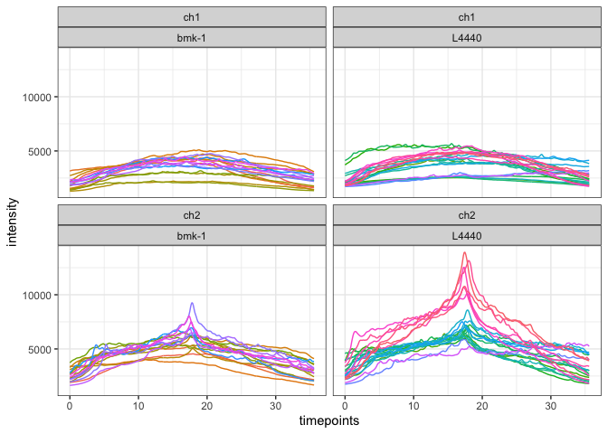
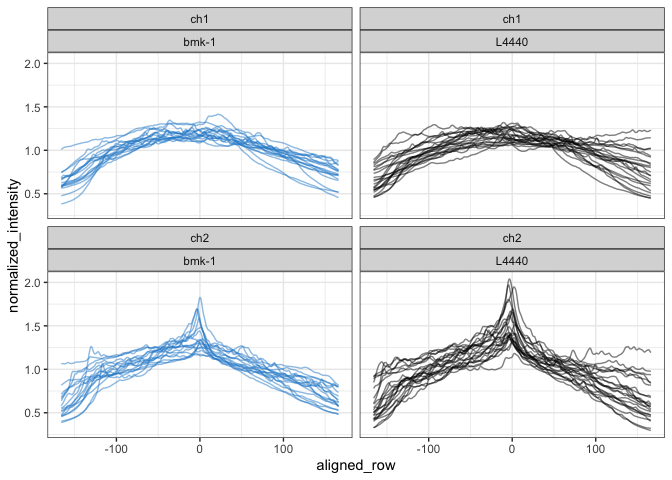
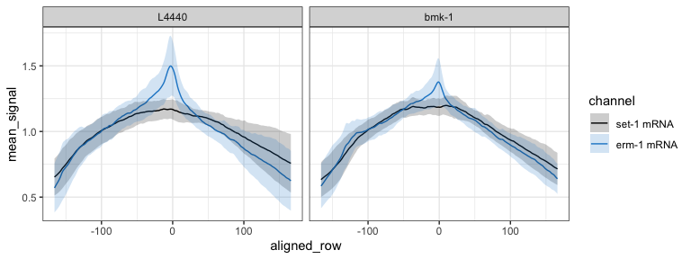
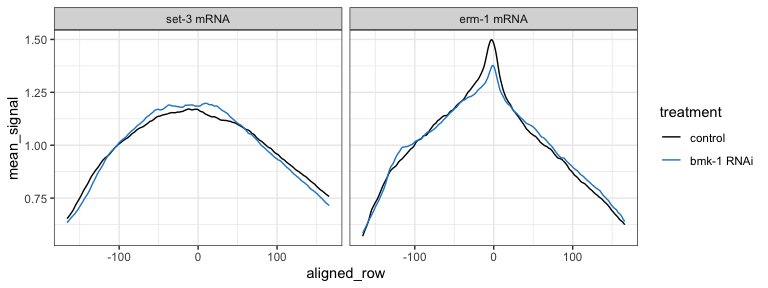
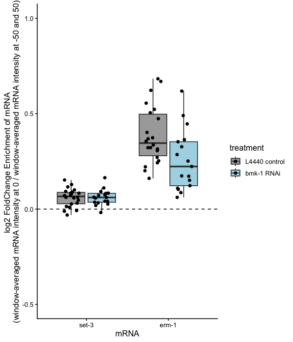
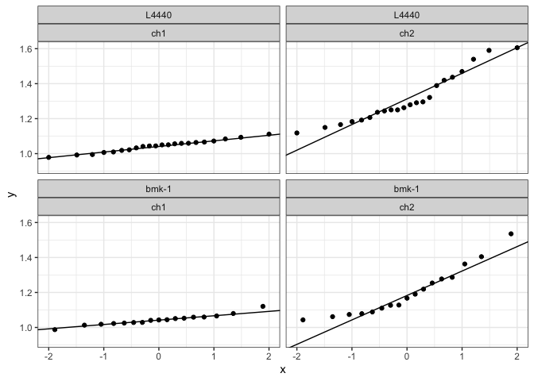

4-cell erm-1 bmk-1 KD analysis
================
Sam Zavislan-Pullaro, Erin Osborne Nishimura
2026-08-26

- [Overview](#overview)
- [Load libraries](#load-libraries)
- [Import the data](#import-the-data)
- [Create annotation columns](#create-annotation-columns)
- [Add timepoints as proxy for position along anterior to posterior
  axis](#add-timepoints-as-proxy-for-position-along-anterior-to-posterior-axis)
- [Use fixed coordinate system](#use-fixed-coordinate-system)
- [re-arrange the dataset and calculate the
  means](#re-arrange-the-dataset-and-calculate-the-means)
- [Visualize normalized linescans](#visualize-normalized-linescans)
- [Create a metric of “membrane-y-ness” for each
  condition](#create-a-metric-of-membrane-y-ness-for-each-condition)
- [Get summary stats for log2 fold change enrichment at membrane vs
  flanking
  regions](#get-summary-stats-for-log2-fold-change-enrichment-at-membrane-vs-flanking-regions)
- [Calculate the statistics](#calculate-the-statistics)
- [Window-based “membrane-y-ness” (alternative to single-point
  fc_enrich)](#window-based-membrane-y-ness-alternative-to-single-point-fc_enrich)
  - [Calculate the window-based
    ratio](#calculate-the-window-based-ratio)
  - [Plot the window-based
    enrichment](#plot-the-window-based-enrichment)
  - [Summary stats](#summary-stats)
  - [Check assumptions](#check-assumptions)
  - [Statistics](#statistics)
- [Export plots and stats](#export-plots-and-stats)
- [Session info](#session-info)

## Overview

This analysis compares the log2 fold enrichment of erm-1 at the ABa -
ABp membrane and ABa - EMS membrane during the 4-cell stage of embryonic
development in C. elegans.

Empty vector RNAi control = L4440

RNAi knockdown condition = bmk-1

## Load libraries

``` r
library(tidyverse)
library(gridExtra)
library(data.table)
library(rstatix)
library(dplyr)
```

## Import the data

Note:

channel 1 = set-3

channel 2 = erm-1

``` r
# import the control data
# control data comes from L4440 empty vector RNAi controls 

# ABa - ABp 
control_1 <- read.table(file = "../01_input/2026-7-11_1324_datafile_for_231107_LP306_L4440.txt", header = FALSE, sep = "\t")
control_2 <- read.table(file = "../01_input/2026-7-11_1252_datafile_for_230713_L4440_RNAi_rep1.txt", header = FALSE, sep = "\t")
control_3 <- read.table(file = "../01_input/2026-7-11_133_datafile_for_230828_L4440_RNAi_rep2.txt", header = FALSE, sep = "\t")
control_4 <- read.table(file = "../01_input/2026-7-11_1337_datafile_for_240122_LP306_L4440-rep3.txt", header = FALSE, sep = "\t")


# import RNAi treatment data 
test_1 <- read.table(file = "../01_input/2026-7-14_126_datafile_for_220719_LP306_bmk-1_RNAi.txt", header = FALSE, sep = "\t")
test_2 <- read.table(file = "../01_input/2026-7-14_1216_datafile_for_230408_LP306_BMK-1_rep1.txt", header = FALSE, sep = "\t")
test_3 <- read.table(file = "../01_input/2026-7-14_1222_datafile_for_231107_LP306_BMK-1_rep2.txt", header = FALSE, sep = "\t")
test_4 <- read.table(file = "../01_input/2026-7-14_1225_datafile_for_231113_LP306_BMK-1_rep3.txt", header = FALSE, sep = "\t")

# ABa - EMS
control_5 <- read.table(file = "../01_input/2026-7-11_1329_datafile_for_231107_LP306_L4440.txt", header = FALSE, sep = "\t")
control_6 <- read.table(file = "../01_input/2026-7-11_1257_datafile_for_230713_L4440_RNAi_rep1.txt", header = FALSE, sep = "\t")
control_7 <- read.table(file = "../01_input/2026-7-11_1311_datafile_for_230828_L4440_RNAi_rep2.txt", header = FALSE, sep = "\t")
control_8 <- read.table(file = "../01_input/2026-7-11_1346_datafile_for_240122_LP306_L4440-rep3.txt", header = FALSE, sep = "\t")


# import RNAi treatment data 
test_5 <- read.table(file = "../01_input/2026-7-14_1233_datafile_for_220719_LP306_bmk-1_RNAi.txt", header = FALSE, sep = "\t")
test_6 <- read.table(file = "../01_input/2026-7-14_1238_datafile_for_230408_LP306_BMK-1_rep1.txt", header = FALSE, sep = "\t")
test_7 <- read.table(file = "../01_input/2026-7-14_1241_datafile_for_231107_LP306_BMK-1_rep2.txt", header = FALSE, sep = "\t")
test_8 <- read.table(file = "../01_input/2026-7-14_1244_datafile_for_231113_LP306_BMK-1_rep3.txt", header = FALSE, sep = "\t")

# Rename the column names
col_times <- paste(rep(1:333), sep = "")

# ABa - ABp
colnames(control_1) <- c("file", "channel", col_times)
colnames(control_2) <- c("file", "channel", col_times)
colnames(control_3) <- c("file", "channel", col_times)
colnames(control_4) <- c("file", "channel", col_times)

colnames(test_1) <- c("file", "channel", col_times)
colnames(test_2) <- c("file", "channel", col_times)
colnames(test_3) <- c("file", "channel", col_times)
colnames(test_4) <- c("file", "channel", col_times)

# ABa - EMS
colnames(control_5) <- c("file", "channel", col_times)
colnames(control_6) <- c("file", "channel", col_times)
colnames(control_7) <- c("file", "channel", col_times)
colnames(control_8) <- c("file", "channel", col_times)

colnames(test_5) <- c("file", "channel", col_times)
colnames(test_6) <- c("file", "channel", col_times)
colnames(test_7) <- c("file", "channel", col_times)
colnames(test_8) <- c("file", "channel", col_times)

# Check that the dimensions remain unchanged
dim(control_1)
```

    ## [1]   3 337

``` r
dim(control_2)
```

    ## [1]   7 337

``` r
dim(control_3)
```

    ## [1]   9 337

``` r
dim(control_4)
```

    ## [1]   7 337

``` r
dim(test_1)
```

    ## [1]   7 337

``` r
dim(test_2)
```

    ## [1]   5 337

``` r
dim(test_3)
```

    ## [1]   7 337

``` r
dim(test_4)
```

    ## [1]   3 337

``` r
dim(control_5)
```

    ## [1]   3 337

``` r
dim(control_6)
```

    ## [1]   7 337

``` r
dim(control_7)
```

    ## [1]   9 337

``` r
dim(control_8)
```

    ## [1]   7 337

``` r
dim(test_5)
```

    ## [1]   7 337

``` r
dim(test_6)
```

    ## [1]   5 337

``` r
dim(test_7)
```

    ## [1]   5 337

``` r
dim(test_8)
```

    ## [1]   3 337

``` r
# control_1[1:9,1:8]
# control_2[1:9,1:8]
# control_3[1:9,1:8]

# test_1[1:9,1:8]
# test_2[1:9,1:8]
# test_3[1:9,1:8]
# test_4[1:9,1:8]
```

## Create annotation columns

``` r
# Extract out the salient information from the filename and pivot the data longer
# Had to manually change image names to follow convention/consistency
# Imaging date in the first field and embryo ID # remained unchanged

# ABa - ABp
control_1_exp <- control_1[2:dim(control_1)[1],1:335] %>%
  separate_wider_delim(file, delim = "_", names = c("date", "strain", "treatment", "embryoID", NA)) %>%
  pivot_longer(cols = `1`:`333`, names_to = "xpoint", values_to = "intensity") %>%
  mutate(unique_id = paste(date, strain, treatment, embryoID, channel, sep = "_"))
 
control_2_exp <- control_2[2:dim(control_2)[1],1:335] %>%
  separate_wider_delim(file, delim = "_", names = c("date", "strain", "treatment", "embryoID", NA)) %>%
  pivot_longer(cols = `1`:`333`, names_to = "xpoint", values_to = "intensity") %>%
  mutate(unique_id = paste(date, strain, treatment, embryoID, channel, sep = "_"))
 
control_3_exp <- control_3[2:dim(control_3)[1],1:335] %>%
  separate_wider_delim(file, delim = "_", names = c("date", "strain", "treatment", "embryoID", NA)) %>%
  pivot_longer(cols = `1`:`333`, names_to = "xpoint", values_to = "intensity") %>%
  mutate(unique_id = paste(date, strain, treatment, embryoID, channel, sep = "_")) 

control_4_exp <- control_4[2:dim(control_4)[1],1:335] %>%
  separate_wider_delim(file, delim = "_", names = c("date", "strain", "treatment", "embryoID", NA)) %>%
  pivot_longer(cols = `1`:`333`, names_to = "xpoint", values_to = "intensity") %>%
  mutate(unique_id = paste(date, strain, treatment, embryoID, channel, sep = "_")) 

 
test_1_exp <- test_1[2:dim(test_1)[1],1:335] %>%
  separate_wider_delim(file, delim = "_", names = c("date", "strain", "treatment", "embryoID", NA)) %>%
  pivot_longer(cols = `1`:`333`, names_to = "xpoint", values_to = "intensity") %>%
  mutate(unique_id = paste(date, strain, treatment, embryoID, channel, sep = "_"))

test_2_exp <- test_2[2:dim(test_2)[1],1:335] %>%
  separate_wider_delim(file, delim = "_", names = c("date", "strain", "treatment", "embryoID", NA)) %>%
  pivot_longer(cols = `1`:`333`, names_to = "xpoint", values_to = "intensity") %>%
  mutate(unique_id = paste(date, strain, treatment, embryoID, channel, sep = "_"))

test_3_exp <- test_3[2:dim(test_3)[1],1:335] %>%
  separate_wider_delim(file, delim = "_", names = c("date", "strain", "treatment", "embryoID", NA)) %>%
  pivot_longer(cols = `1`:`333`, names_to = "xpoint", values_to = "intensity") %>%
  mutate(unique_id = paste(date, strain, treatment, embryoID, channel, sep = "_"))

test_4_exp <- test_4[2:dim(test_4)[1],1:335] %>%
  separate_wider_delim(file, delim = "_", names = c("date", "strain", "treatment", "embryoID", NA)) %>%
  pivot_longer(cols = `1`:`333`, names_to = "xpoint", values_to = "intensity") %>%
  mutate(unique_id = paste(date, strain, treatment, embryoID, channel, sep = "_"))

# ABa - EMS
control_5_exp <- control_5[2:dim(control_5)[1],1:335] %>%
  separate_wider_delim(file, delim = "_", names = c("date", "strain", "treatment", "embryoID", NA)) %>%
  pivot_longer(cols = `1`:`333`, names_to = "xpoint", values_to = "intensity") %>%
  mutate(unique_id = paste(date, strain, treatment, embryoID, channel, sep = "_"))
 
control_6_exp <- control_6[2:dim(control_6)[1],1:335] %>%
  separate_wider_delim(file, delim = "_", names = c("date", "strain", "treatment", "embryoID", NA)) %>%
  pivot_longer(cols = `1`:`333`, names_to = "xpoint", values_to = "intensity") %>%
  mutate(unique_id = paste(date, strain, treatment, embryoID, channel, sep = "_"))
 
control_7_exp <- control_7[2:dim(control_7)[1],1:335] %>%
  separate_wider_delim(file, delim = "_", names = c("date", "strain", "treatment", "embryoID", NA)) %>%
  pivot_longer(cols = `1`:`333`, names_to = "xpoint", values_to = "intensity") %>%
  mutate(unique_id = paste(date, strain, treatment, embryoID, channel, sep = "_")) 

control_8_exp <- control_8[2:dim(control_8)[1],1:335] %>%
  separate_wider_delim(file, delim = "_", names = c("date", "strain", "treatment", "embryoID", NA)) %>%
  pivot_longer(cols = `1`:`333`, names_to = "xpoint", values_to = "intensity") %>%
  mutate(unique_id = paste(date, strain, treatment, embryoID, channel, sep = "_")) 

 
test_5_exp <- test_5[2:dim(test_5)[1],1:335] %>%
  separate_wider_delim(file, delim = "_", names = c("date", "strain", "treatment", "embryoID", NA)) %>%
  pivot_longer(cols = `1`:`333`, names_to = "xpoint", values_to = "intensity") %>%
  mutate(unique_id = paste(date, strain, treatment, embryoID, channel, sep = "_"))

test_6_exp <- test_6[2:dim(test_6)[1],1:335] %>%
  separate_wider_delim(file, delim = "_", names = c("date", "strain", "treatment", "embryoID", NA)) %>%
  pivot_longer(cols = `1`:`333`, names_to = "xpoint", values_to = "intensity") %>%
  mutate(unique_id = paste(date, strain, treatment, embryoID, channel, sep = "_"))

test_7_exp <- test_7[2:dim(test_7)[1],1:335] %>%
  separate_wider_delim(file, delim = "_", names = c("date", "strain", "treatment", "embryoID", NA)) %>%
  pivot_longer(cols = `1`:`333`, names_to = "xpoint", values_to = "intensity") %>%
  mutate(unique_id = paste(date, strain, treatment, embryoID, channel, sep = "_"))

test_8_exp <- test_8[2:dim(test_8)[1],1:335] %>%
  separate_wider_delim(file, delim = "_", names = c("date", "strain", "treatment", "embryoID", NA)) %>%
  pivot_longer(cols = `1`:`333`, names_to = "xpoint", values_to = "intensity") %>%
  mutate(unique_id = paste(date, strain, treatment, embryoID, channel, sep = "_"))
```

## Add timepoints as proxy for position along anterior to posterior axis

``` r
# Add in the timepoints

addInTimepoints <- function(tibble) {
  timepoints <- as.vector(unlist(control_1[1,3:335]))
  repnumb = dim(tibble)[1]/333
  tibble::add_column(tibble, timepoints = rep(timepoints,repnumb), .after = "xpoint")
}

# ABa - ABp
control_1_plustime <- addInTimepoints(control_1_exp)
control_2_plustime <- addInTimepoints(control_2_exp)
control_3_plustime <- addInTimepoints(control_3_exp)
control_4_plustime <- addInTimepoints(control_4_exp)

test_1_plustime <- addInTimepoints(test_1_exp)
test_2_plustime <- addInTimepoints(test_2_exp)
test_3_plustime <- addInTimepoints(test_3_exp)
test_4_plustime <- addInTimepoints(test_4_exp)

# ABa - EMS
control_5_plustime <- addInTimepoints(control_5_exp)
control_6_plustime <- addInTimepoints(control_6_exp)
control_7_plustime <- addInTimepoints(control_7_exp)
control_8_plustime <- addInTimepoints(control_8_exp)

test_5_plustime <- addInTimepoints(test_5_exp)
test_6_plustime <- addInTimepoints(test_6_exp)
test_7_plustime <- addInTimepoints(test_7_exp)
test_8_plustime <- addInTimepoints(test_8_exp)

#check it

# ABa - ABp 
control_1_plustime[330:340,]
```

    ## # A tibble: 11 × 9
    ##    date  strain treatment embryoID channel xpoint timepoints intensity unique_id
    ##    <chr> <chr>  <chr>     <chr>    <chr>   <chr>       <dbl>     <dbl> <chr>    
    ##  1 2311… LP306  L4440     02       ch2     330        35.3       5397. 231107a_…
    ##  2 2311… LP306  L4440     02       ch2     331        35.4       5379. 231107a_…
    ##  3 2311… LP306  L4440     02       ch2     332        35.5       5311. 231107a_…
    ##  4 2311… LP306  L4440     02       ch2     333        35.6       5247. 231107a_…
    ##  5 2311… LP306  L4440     02       ch1     1           0         1781. 231107a_…
    ##  6 2311… LP306  L4440     02       ch1     2           0.107     1786. 231107a_…
    ##  7 2311… LP306  L4440     02       ch1     3           0.214     1791. 231107a_…
    ##  8 2311… LP306  L4440     02       ch1     4           0.322     1794. 231107a_…
    ##  9 2311… LP306  L4440     02       ch1     5           0.429     1799. 231107a_…
    ## 10 2311… LP306  L4440     02       ch1     6           0.536     1801. 231107a_…
    ## 11 2311… LP306  L4440     02       ch1     7           0.643     1805. 231107a_…

``` r
control_2_plustime[330:340,]
```

    ## # A tibble: 11 × 9
    ##    date  strain treatment embryoID channel xpoint timepoints intensity unique_id
    ##    <chr> <chr>  <chr>     <chr>    <chr>   <chr>       <dbl>     <dbl> <chr>    
    ##  1 2307… LP306  L4440     05       ch2     330        35.3       2600. 230713a_…
    ##  2 2307… LP306  L4440     05       ch2     331        35.4       2568. 230713a_…
    ##  3 2307… LP306  L4440     05       ch2     332        35.5       2539. 230713a_…
    ##  4 2307… LP306  L4440     05       ch2     333        35.6       2510. 230713a_…
    ##  5 2307… LP306  L4440     05       ch1     1           0         2068. 230713a_…
    ##  6 2307… LP306  L4440     05       ch1     2           0.107     2080. 230713a_…
    ##  7 2307… LP306  L4440     05       ch1     3           0.214     2094. 230713a_…
    ##  8 2307… LP306  L4440     05       ch1     4           0.322     2104. 230713a_…
    ##  9 2307… LP306  L4440     05       ch1     5           0.429     2116. 230713a_…
    ## 10 2307… LP306  L4440     05       ch1     6           0.536     2129. 230713a_…
    ## 11 2307… LP306  L4440     05       ch1     7           0.643     2143. 230713a_…

``` r
control_3_plustime[330:340,]
```

    ## # A tibble: 11 × 9
    ##    date  strain treatment embryoID channel xpoint timepoints intensity unique_id
    ##    <chr> <chr>  <chr>     <chr>    <chr>   <chr>       <dbl>     <dbl> <chr>    
    ##  1 2308… LP306  L4440     01       ch2     330        35.3       3083. 230828a_…
    ##  2 2308… LP306  L4440     01       ch2     331        35.4       3057. 230828a_…
    ##  3 2308… LP306  L4440     01       ch2     332        35.5       3033. 230828a_…
    ##  4 2308… LP306  L4440     01       ch2     333        35.6       3018. 230828a_…
    ##  5 2308… LP306  L4440     01       ch1     1           0         1778. 230828a_…
    ##  6 2308… LP306  L4440     01       ch1     2           0.107     1781. 230828a_…
    ##  7 2308… LP306  L4440     01       ch1     3           0.214     1790. 230828a_…
    ##  8 2308… LP306  L4440     01       ch1     4           0.322     1795. 230828a_…
    ##  9 2308… LP306  L4440     01       ch1     5           0.429     1800. 230828a_…
    ## 10 2308… LP306  L4440     01       ch1     6           0.536     1811. 230828a_…
    ## 11 2308… LP306  L4440     01       ch1     7           0.643     1815. 230828a_…

``` r
control_4_plustime[330:340,]
```

    ## # A tibble: 11 × 9
    ##    date  strain treatment embryoID channel xpoint timepoints intensity unique_id
    ##    <chr> <chr>  <chr>     <chr>    <chr>   <chr>       <dbl>     <dbl> <chr>    
    ##  1 2401… LP306  L4440     02       ch2     330        35.3       2189. 240122a_…
    ##  2 2401… LP306  L4440     02       ch2     331        35.4       2187. 240122a_…
    ##  3 2401… LP306  L4440     02       ch2     332        35.5       2181. 240122a_…
    ##  4 2401… LP306  L4440     02       ch2     333        35.6       2158. 240122a_…
    ##  5 2401… LP306  L4440     02       ch1     1           0         2156. 240122a_…
    ##  6 2401… LP306  L4440     02       ch1     2           0.107     2185. 240122a_…
    ##  7 2401… LP306  L4440     02       ch1     3           0.214     2213. 240122a_…
    ##  8 2401… LP306  L4440     02       ch1     4           0.322     2251. 240122a_…
    ##  9 2401… LP306  L4440     02       ch1     5           0.429     2277. 240122a_…
    ## 10 2401… LP306  L4440     02       ch1     6           0.536     2310. 240122a_…
    ## 11 2401… LP306  L4440     02       ch1     7           0.643     2347. 240122a_…

``` r
test_1_plustime[330:340,]
```

    ## # A tibble: 11 × 9
    ##    date  strain treatment embryoID channel xpoint timepoints intensity unique_id
    ##    <chr> <chr>  <chr>     <chr>    <chr>   <chr>       <dbl>     <dbl> <chr>    
    ##  1 2207… LP306  bmk-1     07       ch2     330        35.3       4204. 220719a_…
    ##  2 2207… LP306  bmk-1     07       ch2     331        35.4       4164. 220719a_…
    ##  3 2207… LP306  bmk-1     07       ch2     332        35.5       4137. 220719a_…
    ##  4 2207… LP306  bmk-1     07       ch2     333        35.6       4110. 220719a_…
    ##  5 2207… LP306  bmk-1     07       ch1     1           0         1553. 220719a_…
    ##  6 2207… LP306  bmk-1     07       ch1     2           0.107     1564. 220719a_…
    ##  7 2207… LP306  bmk-1     07       ch1     3           0.214     1573. 220719a_…
    ##  8 2207… LP306  bmk-1     07       ch1     4           0.322     1582. 220719a_…
    ##  9 2207… LP306  bmk-1     07       ch1     5           0.429     1593. 220719a_…
    ## 10 2207… LP306  bmk-1     07       ch1     6           0.536     1607. 220719a_…
    ## 11 2207… LP306  bmk-1     07       ch1     7           0.643     1617. 220719a_…

``` r
test_2_plustime[330:340,]
```

    ## # A tibble: 11 × 9
    ##    date  strain treatment embryoID channel xpoint timepoints intensity unique_id
    ##    <chr> <chr>  <chr>     <chr>    <chr>   <chr>       <dbl>     <dbl> <chr>    
    ##  1 2304… LP306  bmk-1     02       ch2     330        35.3       2086. 230408a_…
    ##  2 2304… LP306  bmk-1     02       ch2     331        35.4       2072. 230408a_…
    ##  3 2304… LP306  bmk-1     02       ch2     332        35.5       2051. 230408a_…
    ##  4 2304… LP306  bmk-1     02       ch2     333        35.6       2026. 230408a_…
    ##  5 2304… LP306  bmk-1     02       ch1     1           0         1387. 230408a_…
    ##  6 2304… LP306  bmk-1     02       ch1     2           0.107     1397. 230408a_…
    ##  7 2304… LP306  bmk-1     02       ch1     3           0.214     1407. 230408a_…
    ##  8 2304… LP306  bmk-1     02       ch1     4           0.322     1418. 230408a_…
    ##  9 2304… LP306  bmk-1     02       ch1     5           0.429     1427. 230408a_…
    ## 10 2304… LP306  bmk-1     02       ch1     6           0.536     1439. 230408a_…
    ## 11 2304… LP306  bmk-1     02       ch1     7           0.643     1452. 230408a_…

``` r
test_3_plustime[330:340,]
```

    ## # A tibble: 11 × 9
    ##    date  strain treatment embryoID channel xpoint timepoints intensity unique_id
    ##    <chr> <chr>  <chr>     <chr>    <chr>   <chr>       <dbl>     <dbl> <chr>    
    ##  1 2311… LP306  bmk-1     03       ch2     330        35.3       3378. 231107a_…
    ##  2 2311… LP306  bmk-1     03       ch2     331        35.4       3301. 231107a_…
    ##  3 2311… LP306  bmk-1     03       ch2     332        35.5       3211. 231107a_…
    ##  4 2311… LP306  bmk-1     03       ch2     333        35.6       3131. 231107a_…
    ##  5 2311… LP306  bmk-1     03       ch1     1           0         1896. 231107a_…
    ##  6 2311… LP306  bmk-1     03       ch1     2           0.107     1902. 231107a_…
    ##  7 2311… LP306  bmk-1     03       ch1     3           0.214     1903. 231107a_…
    ##  8 2311… LP306  bmk-1     03       ch1     4           0.322     1910. 231107a_…
    ##  9 2311… LP306  bmk-1     03       ch1     5           0.429     1916. 231107a_…
    ## 10 2311… LP306  bmk-1     03       ch1     6           0.536     1923. 231107a_…
    ## 11 2311… LP306  bmk-1     03       ch1     7           0.643     1927. 231107a_…

``` r
test_4_plustime[330:340,]
```

    ## # A tibble: 11 × 9
    ##    date  strain treatment embryoID channel xpoint timepoints intensity unique_id
    ##    <chr> <chr>  <chr>     <chr>    <chr>   <chr>       <dbl>     <dbl> <chr>    
    ##  1 2311… LP306  bmk-1     02       ch2     330        35.3       3170. 231113a_…
    ##  2 2311… LP306  bmk-1     02       ch2     331        35.4       3142. 231113a_…
    ##  3 2311… LP306  bmk-1     02       ch2     332        35.5       3116. 231113a_…
    ##  4 2311… LP306  bmk-1     02       ch2     333        35.6       3092. 231113a_…
    ##  5 2311… LP306  bmk-1     02       ch1     1           0         2159. 231113a_…
    ##  6 2311… LP306  bmk-1     02       ch1     2           0.107     2162. 231113a_…
    ##  7 2311… LP306  bmk-1     02       ch1     3           0.214     2166. 231113a_…
    ##  8 2311… LP306  bmk-1     02       ch1     4           0.322     2171. 231113a_…
    ##  9 2311… LP306  bmk-1     02       ch1     5           0.429     2181. 231113a_…
    ## 10 2311… LP306  bmk-1     02       ch1     6           0.536     2182. 231113a_…
    ## 11 2311… LP306  bmk-1     02       ch1     7           0.643     2189. 231113a_…

``` r
# ABa - EMS
control_5_plustime[330:340,]
```

    ## # A tibble: 11 × 9
    ##    date  strain treatment embryoID channel xpoint timepoints intensity unique_id
    ##    <chr> <chr>  <chr>     <chr>    <chr>   <chr>       <dbl>     <dbl> <chr>    
    ##  1 2311… LP306  L4440     02       ch2     330        35.3       4057. 231107_L…
    ##  2 2311… LP306  L4440     02       ch2     331        35.4       4058. 231107_L…
    ##  3 2311… LP306  L4440     02       ch2     332        35.5       4052. 231107_L…
    ##  4 2311… LP306  L4440     02       ch2     333        35.6       4031. 231107_L…
    ##  5 2311… LP306  L4440     02       ch1     1           0         1720. 231107_L…
    ##  6 2311… LP306  L4440     02       ch1     2           0.107     1718. 231107_L…
    ##  7 2311… LP306  L4440     02       ch1     3           0.214     1724. 231107_L…
    ##  8 2311… LP306  L4440     02       ch1     4           0.322     1724. 231107_L…
    ##  9 2311… LP306  L4440     02       ch1     5           0.429     1726. 231107_L…
    ## 10 2311… LP306  L4440     02       ch1     6           0.536     1732. 231107_L…
    ## 11 2311… LP306  L4440     02       ch1     7           0.643     1735. 231107_L…

``` r
control_6_plustime[330:340,]
```

    ## # A tibble: 11 × 9
    ##    date  strain treatment embryoID channel xpoint timepoints intensity unique_id
    ##    <chr> <chr>  <chr>     <chr>    <chr>   <chr>       <dbl>     <dbl> <chr>    
    ##  1 2307… LP306  L4440     05       ch2     330        35.3       3080. 230713_L…
    ##  2 2307… LP306  L4440     05       ch2     331        35.4       3072. 230713_L…
    ##  3 2307… LP306  L4440     05       ch2     332        35.5       3045. 230713_L…
    ##  4 2307… LP306  L4440     05       ch2     333        35.6       3019. 230713_L…
    ##  5 2307… LP306  L4440     05       ch1     1           0         2088. 230713_L…
    ##  6 2307… LP306  L4440     05       ch1     2           0.107     2100. 230713_L…
    ##  7 2307… LP306  L4440     05       ch1     3           0.214     2113. 230713_L…
    ##  8 2307… LP306  L4440     05       ch1     4           0.322     2122. 230713_L…
    ##  9 2307… LP306  L4440     05       ch1     5           0.429     2138. 230713_L…
    ## 10 2307… LP306  L4440     05       ch1     6           0.536     2153. 230713_L…
    ## 11 2307… LP306  L4440     05       ch1     7           0.643     2166. 230713_L…

``` r
control_7_plustime[330:340,]
```

    ## # A tibble: 11 × 9
    ##    date  strain treatment embryoID channel xpoint timepoints intensity unique_id
    ##    <chr> <chr>  <chr>     <chr>    <chr>   <chr>       <dbl>     <dbl> <chr>    
    ##  1 2308… LP306  L4440     01       ch2     330        35.3       2095. 230828_L…
    ##  2 2308… LP306  L4440     01       ch2     331        35.4       2081. 230828_L…
    ##  3 2308… LP306  L4440     01       ch2     332        35.5       2066. 230828_L…
    ##  4 2308… LP306  L4440     01       ch2     333        35.6       2052. 230828_L…
    ##  5 2308… LP306  L4440     01       ch1     1           0         1813. 230828_L…
    ##  6 2308… LP306  L4440     01       ch1     2           0.107     1815. 230828_L…
    ##  7 2308… LP306  L4440     01       ch1     3           0.214     1820. 230828_L…
    ##  8 2308… LP306  L4440     01       ch1     4           0.322     1828. 230828_L…
    ##  9 2308… LP306  L4440     01       ch1     5           0.429     1838. 230828_L…
    ## 10 2308… LP306  L4440     01       ch1     6           0.536     1844. 230828_L…
    ## 11 2308… LP306  L4440     01       ch1     7           0.643     1850. 230828_L…

``` r
control_8_plustime[330:340,]
```

    ## # A tibble: 11 × 9
    ##    date  strain treatment embryoID channel xpoint timepoints intensity unique_id
    ##    <chr> <chr>  <chr>     <chr>    <chr>   <chr>       <dbl>     <dbl> <chr>    
    ##  1 2401… LP306  L4440     02       ch2     330        35.3       1864. 240122_L…
    ##  2 2401… LP306  L4440     02       ch2     331        35.4       1848. 240122_L…
    ##  3 2401… LP306  L4440     02       ch2     332        35.5       1831. 240122_L…
    ##  4 2401… LP306  L4440     02       ch2     333        35.6       1817. 240122_L…
    ##  5 2401… LP306  L4440     02       ch1     1           0         2211. 240122_L…
    ##  6 2401… LP306  L4440     02       ch1     2           0.107     2245. 240122_L…
    ##  7 2401… LP306  L4440     02       ch1     3           0.214     2279. 240122_L…
    ##  8 2401… LP306  L4440     02       ch1     4           0.322     2311. 240122_L…
    ##  9 2401… LP306  L4440     02       ch1     5           0.429     2345. 240122_L…
    ## 10 2401… LP306  L4440     02       ch1     6           0.536     2390. 240122_L…
    ## 11 2401… LP306  L4440     02       ch1     7           0.643     2429. 240122_L…

``` r
test_5_plustime[330:340,]
```

    ## # A tibble: 11 × 9
    ##    date  strain treatment embryoID channel xpoint timepoints intensity unique_id
    ##    <chr> <chr>  <chr>     <chr>    <chr>   <chr>       <dbl>     <dbl> <chr>    
    ##  1 2207… LP306  bmk-1     07       ch2     330        35.3       2198. 220719_L…
    ##  2 2207… LP306  bmk-1     07       ch2     331        35.4       2182. 220719_L…
    ##  3 2207… LP306  bmk-1     07       ch2     332        35.5       2174. 220719_L…
    ##  4 2207… LP306  bmk-1     07       ch2     333        35.6       2168. 220719_L…
    ##  5 2207… LP306  bmk-1     07       ch1     1           0         1484. 220719_L…
    ##  6 2207… LP306  bmk-1     07       ch1     2           0.107     1492. 220719_L…
    ##  7 2207… LP306  bmk-1     07       ch1     3           0.214     1502. 220719_L…
    ##  8 2207… LP306  bmk-1     07       ch1     4           0.322     1507. 220719_L…
    ##  9 2207… LP306  bmk-1     07       ch1     5           0.429     1516. 220719_L…
    ## 10 2207… LP306  bmk-1     07       ch1     6           0.536     1525. 220719_L…
    ## 11 2207… LP306  bmk-1     07       ch1     7           0.643     1534. 220719_L…

``` r
test_6_plustime[330:340,]
```

    ## # A tibble: 11 × 9
    ##    date  strain treatment embryoID channel xpoint timepoints intensity unique_id
    ##    <chr> <chr>  <chr>     <chr>    <chr>   <chr>       <dbl>     <dbl> <chr>    
    ##  1 2304… LP306  bmk-1     02       ch2     330        35.3       2541. 230408_L…
    ##  2 2304… LP306  bmk-1     02       ch2     331        35.4       2505. 230408_L…
    ##  3 2304… LP306  bmk-1     02       ch2     332        35.5       2465. 230408_L…
    ##  4 2304… LP306  bmk-1     02       ch2     333        35.6       2435. 230408_L…
    ##  5 2304… LP306  bmk-1     02       ch1     1           0         1287. 230408_L…
    ##  6 2304… LP306  bmk-1     02       ch1     2           0.107     1291. 230408_L…
    ##  7 2304… LP306  bmk-1     02       ch1     3           0.214     1296. 230408_L…
    ##  8 2304… LP306  bmk-1     02       ch1     4           0.322     1299. 230408_L…
    ##  9 2304… LP306  bmk-1     02       ch1     5           0.429     1302. 230408_L…
    ## 10 2304… LP306  bmk-1     02       ch1     6           0.536     1306. 230408_L…
    ## 11 2304… LP306  bmk-1     02       ch1     7           0.643     1313. 230408_L…

``` r
test_7_plustime[330:340,]
```

    ## # A tibble: 11 × 9
    ##    date  strain treatment embryoID channel xpoint timepoints intensity unique_id
    ##    <chr> <chr>  <chr>     <chr>    <chr>   <chr>       <dbl>     <dbl> <chr>    
    ##  1 2311… LP306  bmk-1     03       ch2     330        35.3       3900. 231107_L…
    ##  2 2311… LP306  bmk-1     03       ch2     331        35.4       3861. 231107_L…
    ##  3 2311… LP306  bmk-1     03       ch2     332        35.5       3850. 231107_L…
    ##  4 2311… LP306  bmk-1     03       ch2     333        35.6       3844. 231107_L…
    ##  5 2311… LP306  bmk-1     03       ch1     1           0         2155. 231107_L…
    ##  6 2311… LP306  bmk-1     03       ch1     2           0.107     2175. 231107_L…
    ##  7 2311… LP306  bmk-1     03       ch1     3           0.214     2191. 231107_L…
    ##  8 2311… LP306  bmk-1     03       ch1     4           0.322     2204. 231107_L…
    ##  9 2311… LP306  bmk-1     03       ch1     5           0.429     2221. 231107_L…
    ## 10 2311… LP306  bmk-1     03       ch1     6           0.536     2236. 231107_L…
    ## 11 2311… LP306  bmk-1     03       ch1     7           0.643     2251. 231107_L…

``` r
test_8_plustime[330:340,]
```

    ## # A tibble: 11 × 9
    ##    date  strain treatment embryoID channel xpoint timepoints intensity unique_id
    ##    <chr> <chr>  <chr>     <chr>    <chr>   <chr>       <dbl>     <dbl> <chr>    
    ##  1 2311… LP306  bmk-1     02       ch2     330        35.3       2859. 231113_L…
    ##  2 2311… LP306  bmk-1     02       ch2     331        35.4       2809. 231113_L…
    ##  3 2311… LP306  bmk-1     02       ch2     332        35.5       2768. 231113_L…
    ##  4 2311… LP306  bmk-1     02       ch2     333        35.6       2736. 231113_L…
    ##  5 2311… LP306  bmk-1     02       ch1     1           0         2300. 231113_L…
    ##  6 2311… LP306  bmk-1     02       ch1     2           0.107     2333. 231113_L…
    ##  7 2311… LP306  bmk-1     02       ch1     3           0.214     2370. 231113_L…
    ##  8 2311… LP306  bmk-1     02       ch1     4           0.322     2383. 231113_L…
    ##  9 2311… LP306  bmk-1     02       ch1     5           0.429     2375. 231113_L…
    ## 10 2311… LP306  bmk-1     02       ch1     6           0.536     2360. 231113_L…
    ## 11 2311… LP306  bmk-1     02       ch1     7           0.643     2349. 231113_L…

``` r
# Merge the datasets together 
bmk1_RNAi_data_total <- rbind(control_1_plustime, control_2_plustime, control_3_plustime, control_4_plustime, test_1_plustime, test_2_plustime, test_3_plustime, test_4_plustime, control_5_plustime, control_6_plustime, control_7_plustime, control_8_plustime, test_5_plustime, test_6_plustime, test_7_plustime, test_8_plustime)

head(bmk1_RNAi_data_total)
```

    ## # A tibble: 6 × 9
    ##   date   strain treatment embryoID channel xpoint timepoints intensity unique_id
    ##   <chr>  <chr>  <chr>     <chr>    <chr>   <chr>       <dbl>     <dbl> <chr>    
    ## 1 23110… LP306  L4440     02       ch2     1           0         1878. 231107a_…
    ## 2 23110… LP306  L4440     02       ch2     2           0.107     1894. 231107a_…
    ## 3 23110… LP306  L4440     02       ch2     3           0.214     1914. 231107a_…
    ## 4 23110… LP306  L4440     02       ch2     4           0.322     1929. 231107a_…
    ## 5 23110… LP306  L4440     02       ch2     5           0.429     1949. 231107a_…
    ## 6 23110… LP306  L4440     02       ch2     6           0.536     1970. 231107a_…

``` r
# Plot all samples
ggplot(data = bmk1_RNAi_data_total, aes(x = timepoints, y = intensity, group = c(unique_id))) +
  geom_line(aes(colour = unique_id))+
  facet_wrap(~ channel + treatment)+
  guides(color = "none")+
  theme_bw()
```

<!-- -->

## Use fixed coordinate system

Peak alignment not used in this analysis because. Aligning each embryo
to its own observed channel-2 peak risks manufacturing apparent
enrichment at the alignment point, since by construction that point is
the brightest value in every embryo. Instead, every embryo uses the same
fixed coordinate system based on its row position (`xpoint`), recentered
so it spans the same `-166:166` range.

``` r
bmk1_dt <- as.data.table(bmk1_RNAi_data_total)
bmk1_dt$xpoint <- as.integer(bmk1_dt$xpoint)

# Fixed coordinate: recenter xpoint (1:333) to run -166:166, identical for
# every embryo and every channel - no peak-finding, no per-embryo offset.
bmk1_dt[, aligned_row := xpoint - 167]

# Check that everything worked
dim(bmk1_RNAi_data_total)
```

    ## [1] 25974     9

``` r
dim(bmk1_dt)
```

    ## [1] 25974    10

``` r
range(bmk1_dt$aligned_row)
```

    ## [1] -166  166

``` r
# Rename to match the variable name the rest of the script expects
total_align_long <- bmk1_dt %>%
  select(strain, aligned_row, unique_id, intensity)
```

``` r
# Data-completeness check: for each position in the fixed coordinate
# (aligned_row, -166:166), count total observations and how many are NA.
# Every embryo covers the full -166:166 range with real values, so
# pct_na should be 0 throughout. Non-zero values would flag missing
# data in the raw macro output.

total_align_long %>%
  group_by(aligned_row) %>%
  summarize(
    n_total = n(),
    n_na = sum(is.na(intensity)),
    pct_na = mean(is.na(intensity)) * 100
  ) %>%
  arrange(aligned_row) %>%
  print(n = Inf)
```

    ## # A tibble: 333 × 4
    ##     aligned_row n_total  n_na pct_na
    ##           <dbl>   <int> <int>  <dbl>
    ##   1        -166      78     0      0
    ##   2        -165      78     0      0
    ##   3        -164      78     0      0
    ##   4        -163      78     0      0
    ##   5        -162      78     0      0
    ##   6        -161      78     0      0
    ##   7        -160      78     0      0
    ##   8        -159      78     0      0
    ##   9        -158      78     0      0
    ##  10        -157      78     0      0
    ##  11        -156      78     0      0
    ##  12        -155      78     0      0
    ##  13        -154      78     0      0
    ##  14        -153      78     0      0
    ##  15        -152      78     0      0
    ##  16        -151      78     0      0
    ##  17        -150      78     0      0
    ##  18        -149      78     0      0
    ##  19        -148      78     0      0
    ##  20        -147      78     0      0
    ##  21        -146      78     0      0
    ##  22        -145      78     0      0
    ##  23        -144      78     0      0
    ##  24        -143      78     0      0
    ##  25        -142      78     0      0
    ##  26        -141      78     0      0
    ##  27        -140      78     0      0
    ##  28        -139      78     0      0
    ##  29        -138      78     0      0
    ##  30        -137      78     0      0
    ##  31        -136      78     0      0
    ##  32        -135      78     0      0
    ##  33        -134      78     0      0
    ##  34        -133      78     0      0
    ##  35        -132      78     0      0
    ##  36        -131      78     0      0
    ##  37        -130      78     0      0
    ##  38        -129      78     0      0
    ##  39        -128      78     0      0
    ##  40        -127      78     0      0
    ##  41        -126      78     0      0
    ##  42        -125      78     0      0
    ##  43        -124      78     0      0
    ##  44        -123      78     0      0
    ##  45        -122      78     0      0
    ##  46        -121      78     0      0
    ##  47        -120      78     0      0
    ##  48        -119      78     0      0
    ##  49        -118      78     0      0
    ##  50        -117      78     0      0
    ##  51        -116      78     0      0
    ##  52        -115      78     0      0
    ##  53        -114      78     0      0
    ##  54        -113      78     0      0
    ##  55        -112      78     0      0
    ##  56        -111      78     0      0
    ##  57        -110      78     0      0
    ##  58        -109      78     0      0
    ##  59        -108      78     0      0
    ##  60        -107      78     0      0
    ##  61        -106      78     0      0
    ##  62        -105      78     0      0
    ##  63        -104      78     0      0
    ##  64        -103      78     0      0
    ##  65        -102      78     0      0
    ##  66        -101      78     0      0
    ##  67        -100      78     0      0
    ##  68         -99      78     0      0
    ##  69         -98      78     0      0
    ##  70         -97      78     0      0
    ##  71         -96      78     0      0
    ##  72         -95      78     0      0
    ##  73         -94      78     0      0
    ##  74         -93      78     0      0
    ##  75         -92      78     0      0
    ##  76         -91      78     0      0
    ##  77         -90      78     0      0
    ##  78         -89      78     0      0
    ##  79         -88      78     0      0
    ##  80         -87      78     0      0
    ##  81         -86      78     0      0
    ##  82         -85      78     0      0
    ##  83         -84      78     0      0
    ##  84         -83      78     0      0
    ##  85         -82      78     0      0
    ##  86         -81      78     0      0
    ##  87         -80      78     0      0
    ##  88         -79      78     0      0
    ##  89         -78      78     0      0
    ##  90         -77      78     0      0
    ##  91         -76      78     0      0
    ##  92         -75      78     0      0
    ##  93         -74      78     0      0
    ##  94         -73      78     0      0
    ##  95         -72      78     0      0
    ##  96         -71      78     0      0
    ##  97         -70      78     0      0
    ##  98         -69      78     0      0
    ##  99         -68      78     0      0
    ## 100         -67      78     0      0
    ## 101         -66      78     0      0
    ## 102         -65      78     0      0
    ## 103         -64      78     0      0
    ## 104         -63      78     0      0
    ## 105         -62      78     0      0
    ## 106         -61      78     0      0
    ## 107         -60      78     0      0
    ## 108         -59      78     0      0
    ## 109         -58      78     0      0
    ## 110         -57      78     0      0
    ## 111         -56      78     0      0
    ## 112         -55      78     0      0
    ## 113         -54      78     0      0
    ## 114         -53      78     0      0
    ## 115         -52      78     0      0
    ## 116         -51      78     0      0
    ## 117         -50      78     0      0
    ## 118         -49      78     0      0
    ## 119         -48      78     0      0
    ## 120         -47      78     0      0
    ## 121         -46      78     0      0
    ## 122         -45      78     0      0
    ## 123         -44      78     0      0
    ## 124         -43      78     0      0
    ## 125         -42      78     0      0
    ## 126         -41      78     0      0
    ## 127         -40      78     0      0
    ## 128         -39      78     0      0
    ## 129         -38      78     0      0
    ## 130         -37      78     0      0
    ## 131         -36      78     0      0
    ## 132         -35      78     0      0
    ## 133         -34      78     0      0
    ## 134         -33      78     0      0
    ## 135         -32      78     0      0
    ## 136         -31      78     0      0
    ## 137         -30      78     0      0
    ## 138         -29      78     0      0
    ## 139         -28      78     0      0
    ## 140         -27      78     0      0
    ## 141         -26      78     0      0
    ## 142         -25      78     0      0
    ## 143         -24      78     0      0
    ## 144         -23      78     0      0
    ## 145         -22      78     0      0
    ## 146         -21      78     0      0
    ## 147         -20      78     0      0
    ## 148         -19      78     0      0
    ## 149         -18      78     0      0
    ## 150         -17      78     0      0
    ## 151         -16      78     0      0
    ## 152         -15      78     0      0
    ## 153         -14      78     0      0
    ## 154         -13      78     0      0
    ## 155         -12      78     0      0
    ## 156         -11      78     0      0
    ## 157         -10      78     0      0
    ## 158          -9      78     0      0
    ## 159          -8      78     0      0
    ## 160          -7      78     0      0
    ## 161          -6      78     0      0
    ## 162          -5      78     0      0
    ## 163          -4      78     0      0
    ## 164          -3      78     0      0
    ## 165          -2      78     0      0
    ## 166          -1      78     0      0
    ## 167           0      78     0      0
    ## 168           1      78     0      0
    ## 169           2      78     0      0
    ## 170           3      78     0      0
    ## 171           4      78     0      0
    ## 172           5      78     0      0
    ## 173           6      78     0      0
    ## 174           7      78     0      0
    ## 175           8      78     0      0
    ## 176           9      78     0      0
    ## 177          10      78     0      0
    ## 178          11      78     0      0
    ## 179          12      78     0      0
    ## 180          13      78     0      0
    ## 181          14      78     0      0
    ## 182          15      78     0      0
    ## 183          16      78     0      0
    ## 184          17      78     0      0
    ## 185          18      78     0      0
    ## 186          19      78     0      0
    ## 187          20      78     0      0
    ## 188          21      78     0      0
    ## 189          22      78     0      0
    ## 190          23      78     0      0
    ## 191          24      78     0      0
    ## 192          25      78     0      0
    ## 193          26      78     0      0
    ## 194          27      78     0      0
    ## 195          28      78     0      0
    ## 196          29      78     0      0
    ## 197          30      78     0      0
    ## 198          31      78     0      0
    ## 199          32      78     0      0
    ## 200          33      78     0      0
    ## 201          34      78     0      0
    ## 202          35      78     0      0
    ## 203          36      78     0      0
    ## 204          37      78     0      0
    ## 205          38      78     0      0
    ## 206          39      78     0      0
    ## 207          40      78     0      0
    ## 208          41      78     0      0
    ## 209          42      78     0      0
    ## 210          43      78     0      0
    ## 211          44      78     0      0
    ## 212          45      78     0      0
    ## 213          46      78     0      0
    ## 214          47      78     0      0
    ## 215          48      78     0      0
    ## 216          49      78     0      0
    ## 217          50      78     0      0
    ## 218          51      78     0      0
    ## 219          52      78     0      0
    ## 220          53      78     0      0
    ## 221          54      78     0      0
    ## 222          55      78     0      0
    ## 223          56      78     0      0
    ## 224          57      78     0      0
    ## 225          58      78     0      0
    ## 226          59      78     0      0
    ## 227          60      78     0      0
    ## 228          61      78     0      0
    ## 229          62      78     0      0
    ## 230          63      78     0      0
    ## 231          64      78     0      0
    ## 232          65      78     0      0
    ## 233          66      78     0      0
    ## 234          67      78     0      0
    ## 235          68      78     0      0
    ## 236          69      78     0      0
    ## 237          70      78     0      0
    ## 238          71      78     0      0
    ## 239          72      78     0      0
    ## 240          73      78     0      0
    ## 241          74      78     0      0
    ## 242          75      78     0      0
    ## 243          76      78     0      0
    ## 244          77      78     0      0
    ## 245          78      78     0      0
    ## 246          79      78     0      0
    ## 247          80      78     0      0
    ## 248          81      78     0      0
    ## 249          82      78     0      0
    ## 250          83      78     0      0
    ## 251          84      78     0      0
    ## 252          85      78     0      0
    ## 253          86      78     0      0
    ## 254          87      78     0      0
    ## 255          88      78     0      0
    ## 256          89      78     0      0
    ## 257          90      78     0      0
    ## 258          91      78     0      0
    ## 259          92      78     0      0
    ## 260          93      78     0      0
    ## 261          94      78     0      0
    ## 262          95      78     0      0
    ## 263          96      78     0      0
    ## 264          97      78     0      0
    ## 265          98      78     0      0
    ## 266          99      78     0      0
    ## 267         100      78     0      0
    ## 268         101      78     0      0
    ## 269         102      78     0      0
    ## 270         103      78     0      0
    ## 271         104      78     0      0
    ## 272         105      78     0      0
    ## 273         106      78     0      0
    ## 274         107      78     0      0
    ## 275         108      78     0      0
    ## 276         109      78     0      0
    ## 277         110      78     0      0
    ## 278         111      78     0      0
    ## 279         112      78     0      0
    ## 280         113      78     0      0
    ## 281         114      78     0      0
    ## 282         115      78     0      0
    ## 283         116      78     0      0
    ## 284         117      78     0      0
    ## 285         118      78     0      0
    ## 286         119      78     0      0
    ## 287         120      78     0      0
    ## 288         121      78     0      0
    ## 289         122      78     0      0
    ## 290         123      78     0      0
    ## 291         124      78     0      0
    ## 292         125      78     0      0
    ## 293         126      78     0      0
    ## 294         127      78     0      0
    ## 295         128      78     0      0
    ## 296         129      78     0      0
    ## 297         130      78     0      0
    ## 298         131      78     0      0
    ## 299         132      78     0      0
    ## 300         133      78     0      0
    ## 301         134      78     0      0
    ## 302         135      78     0      0
    ## 303         136      78     0      0
    ## 304         137      78     0      0
    ## 305         138      78     0      0
    ## 306         139      78     0      0
    ## 307         140      78     0      0
    ## 308         141      78     0      0
    ## 309         142      78     0      0
    ## 310         143      78     0      0
    ## 311         144      78     0      0
    ## 312         145      78     0      0
    ## 313         146      78     0      0
    ## 314         147      78     0      0
    ## 315         148      78     0      0
    ## 316         149      78     0      0
    ## 317         150      78     0      0
    ## 318         151      78     0      0
    ## 319         152      78     0      0
    ## 320         153      78     0      0
    ## 321         154      78     0      0
    ## 322         155      78     0      0
    ## 323         156      78     0      0
    ## 324         157      78     0      0
    ## 325         158      78     0      0
    ## 326         159      78     0      0
    ## 327         160      78     0      0
    ## 328         161      78     0      0
    ## 329         162      78     0      0
    ## 330         163      78     0      0
    ## 331         164      78     0      0
    ## 332         165      78     0      0
    ## 333         166      78     0      0

## re-arrange the dataset and calculate the means

``` r
# Normalize the data by dividing by the embryo-specific mean
bmk1_norm_total <- total_align_long %>%
  separate_wider_delim(unique_id, delim = "_", names = c("date", NA, "treatment", "embryoID", "channel")) %>%
  group_by(date, embryoID, channel, treatment) %>%
  mutate(normalized_intensity = intensity / mean(intensity, na.rm = TRUE))
table(bmk1_norm_total$channel, bmk1_norm_total$treatment)
```

    ##      
    ##       bmk-1 L4440
    ##   ch1  5661  7326
    ##   ch2  5661  7326

``` r
head(bmk1_norm_total)
```

    ## # A tibble: 6 × 8
    ## # Groups:   date, embryoID, channel, treatment [1]
    ##   strain aligned_row date    treatment embryoID channel intensity
    ##   <chr>        <dbl> <chr>   <chr>     <chr>    <chr>       <dbl>
    ## 1 LP306         -166 231107a L4440     02       ch2         1878.
    ## 2 LP306         -165 231107a L4440     02       ch2         1894.
    ## 3 LP306         -164 231107a L4440     02       ch2         1914.
    ## 4 LP306         -163 231107a L4440     02       ch2         1929.
    ## 5 LP306         -162 231107a L4440     02       ch2         1949.
    ## 6 LP306         -161 231107a L4440     02       ch2         1970.
    ## # ℹ 1 more variable: normalized_intensity <dbl>

``` r
# Exclude 220719_12 (ch2) for now - identified as having an atypical
# secondary shoulder before the main peak (color-matched from the
# line-scan plot). Pending review of the raw image; remove this filter
# once resolved, or add more rows to excluded_embryos to drop others.

excluded_embryos <- tibble::tribble(
  ~date,    ~embryoID, ~channel,
  "231107", "13",      "ch2"
)

bmk1_norm_total <- bmk1_norm_total %>%
  anti_join(excluded_embryos, by = c("date", "embryoID", "channel"))

# Confirm removal - counts should drop by one embryo in ch2/bmk-1
table(bmk1_norm_total$channel, bmk1_norm_total$treatment)
```

    ##      
    ##       bmk-1 L4440
    ##   ch1  5661  7326
    ##   ch2  5661  7326

## Visualize normalized linescans

``` r
normalized_linescan <- ggplot(data = bmk1_norm_total, aes(x = aligned_row, y = normalized_intensity, 
                                     group = interaction(date, embryoID, channel))) +
  geom_line(aes(color = treatment), alpha = 0.5) +
  scale_color_manual(values = c("#2189ce", "#000000")) +
  facet_wrap(~ channel + treatment) +
  guides(color = "none") +
  theme_bw()
normalized_linescan
```

<!-- -->

``` r
# treatment_colors <- c(
#   "L4440"   = "darkgray",
#   "bmk-1"   = "lightblue"
# )
# 
# mean_signal <- bmk1_norm_total %>%
#   group_by(aligned_row, treatment, channel) %>%
#   summarize(
#     mean_signal = mean(normalized_intensity, na.rm = TRUE),
#     sd_signal   = sd(normalized_intensity,   na.rm = TRUE),
#     .groups     = "drop"
#   ) %>%
#   mutate(
#     ymeanmax = mean_signal + sd_signal,
#     ymeanmin = mean_signal - sd_signal
#   )
# 
# kinesin_treatments <- c("L4440", "bmk-1")
# 
# channel_labels <- c("ch1" = "set-3 mRNA", "ch2" = "erm-1 mRNA")
# 
# mean_signal_kinesins <- mean_signal %>%
#   filter(treatment %in% kinesin_treatments)
# 
# ggplot(mean_signal_kinesins,
#        aes(x = aligned_row, y = mean_signal,
#            color = treatment, fill = treatment,
#            group = treatment)) +
#   geom_line(linewidth = 0.8) +
#   scale_color_manual(values = treatment_colors) +
#   scale_fill_manual(values  = treatment_colors) +
#   facet_wrap(~ channel, labeller = labeller(channel = channel_labels)) +
#   labs(
#     title  = "Mean normalized 4 -cell line scans - L4440 vs bmk-1 KD",
#     x      = "Position",
#     y      = "Mean normalized intensity",
#     color  = "Treatment",
#     fill   = "Treatment"
#   ) +
#   theme_bw(base_size = 12) +
#   theme(strip.text = element_text(face = "bold"),
#         legend.position = "right")
```

``` r
# Separate out the unique identifier info, then pivot sider
bmk1_wide_by_sample <- bmk1_norm_total %>%
  pivot_wider(names_from = c(date, embryoID, channel, treatment), 
            values_from = normalized_intensity,
            id_cols = c(strain, aligned_row))


# Second Try - Separate out the unique identifier info, then pivot sider
bmk1_wide_by_sample <- bmk1_norm_total %>%
  pivot_wider(names_from = c(date, embryoID), 
            values_from = normalized_intensity,
            id_cols = c(strain, aligned_row, treatment, channel))

colnames(bmk1_wide_by_sample)
```

    ##  [1] "strain"      "aligned_row" "treatment"   "channel"     "231107a_02" 
    ##  [6] "230713a_05"  "230713a_07"  "230713a_11"  "230828a_01"  "230828a_02" 
    ## [11] "230828a_04"  "230828a_06"  "240122a_02"  "240122a_05"  "240122a_10" 
    ## [16] "220719a_07"  "220719a_08"  "220719a_12"  "230408a_02"  "230408a_05" 
    ## [21] "231107a_03"  "231107a_05"  "231107a_13"  "231113a_02"  "231107_02"  
    ## [26] "230713_05"   "230713_07"   "230713_11"   "230828_01"   "230828_02"  
    ## [31] "230828_04"   "230828_06"   "240122_02"   "240122_05"   "240122_10"  
    ## [36] "220719_07"   "220719_08"   "220719_12"   "230408_02"   "230408_05"  
    ## [41] "231107_03"   "231107_05"   "231113_02"

``` r
# Play around with mean, medium, and sum:
bmk1_wide_with_stats <- bmk1_wide_by_sample %>%
  rowwise() %>%
  mutate(
    sum_signal    = sum(c_across(`231107a_02`:`231113_02`), na.rm = TRUE),
    mean_signal   = mean(c_across(`231107a_02`:`231113_02`), na.rm = TRUE),
    median_signal = median(c_across(`231107a_02`:`231113_02`), na.rm = TRUE),
    sd_signal     = sd(c_across(`231107a_02`:`231113_02`), na.rm = TRUE)
  ) %>%
  ungroup()

# colnames(bmk1_wide_with_stats)

bmk1_wide_with_range <- bmk1_wide_with_stats %>%
  rowwise() %>%
  mutate(ymeanmax = sum(mean_signal, sd_signal) ) %>%
  mutate(ymeanmin = sum(mean_signal, -sd_signal)) %>%
  ungroup() %>%
  mutate(treatment = factor(treatment, levels = c("L4440", "bmk-1")))

colorselection = c("#000000", "#2189ce")

# Plot split by RNAi treatment and L4440 empty vector control 
a <- ggplot(data = bmk1_wide_with_range, aes(x = aligned_row, y = mean_signal, group = interaction(channel, treatment))) +
  geom_line(aes(color = channel)) +
  scale_color_manual(values = colorselection, aesthetics = c("colour", "fill"), labels = c("set-1 mRNA", "erm-1 mRNA")) +
  geom_ribbon(aes(ymin = ymeanmin, ymax = ymeanmax, fill = channel), alpha = 0.2) +
  facet_wrap(~ treatment) +
  scale_y_continuous(breaks = seq(0, 3, by = 0.5)) +
  theme_bw()
a
```

<!-- -->

``` r
# Plot in a different way - set-3 and erm-1 mRNA split into facets
colorselection = c("#000000", "#2189ce")
channel.labs <- c("set-3 mRNA", "erm-1 mRNA")
names(channel.labs) <- c("ch1", "ch2")

# Plot split by transcript
b <- ggplot(data = bmk1_wide_with_range, aes(x = aligned_row, y = mean_signal, group = interaction(channel, treatment)))+
  geom_line(aes(color=treatment))+
  scale_color_manual(values = colorselection, aesthetics = c("colour", "fill"), labels = c("control", "bmk-1 RNAi"))+
  facet_wrap(~ channel, labeller = labeller(channel = channel.labs))+
  theme_bw()

b
```

<!-- -->

## Create a metric of “membrane-y-ness” for each condition

We are comparing the log2 fold change intensity at the membrane to the
flanking regions along the anterior to posterior axis

For 2-cell stage, we used the range: -100,0,100

For 4-cell stage, use -50,0,50 range because the cells are smaller, and
the orientation of the membrane can push the ROI quantification box
outside of the embryo.

``` r
# extract the peak intensity versus the -50 and +50 values
# peaks_and_valleys <- bmk1_norm_total %>%
#   filter(aligned_row %in% c(-50,0,50))
# 
# # Nest the -50, 1, and +50 values
# nest_pandv <- peaks_and_valleys %>%
#   group_by(date, treatment, embryoID, channel) %>%
#   nest()
# 
# # A function to calculate the ratio of the value at 1 compared to the mean of positions, -50 and +50
# my_calc2 <- function(df) {
#   df$normalized_intensity[2] / mean(c(df$normalized_intensity[1], df$normalized_intensity[3]))
# }
# 
# # Calculate the ratio for each datapoint
# foldChange_calc <- nest_pandv %>%
#   mutate(fc_enrich = map_dbl(data, my_calc2))
# 
# # Change some columns to factors
# foldChange_calc$treatment <- factor(foldChange_calc$treatment, levels = c("L4440", "bmk-1")) 
# foldChange_calc$channel <- as.factor(foldChange_calc$channel)


# plot the data:
# d <- ggplot(data = foldChange_calc, aes(x = as.factor(channel), y = log(fc_enrich, base = 2), fill = treatment))+
#   geom_boxplot(outlier.shape = NA)+
#   geom_jitter(position=position_jitterdodge())+
#   scale_y_continuous(limits = c(-0.5, 1.0)) +
#   geom_hline(yintercept = 0, linetype = "dashed") +
#   scale_fill_manual(values = c("L4440" = "darkgray", "bmk-1" = "lightblue"),
#                    labels = c("L4440" = "L4440 control", "bmk-1" = "bmk-1 RNAi"))+labs(y = "log2 FoldChange Enrichment of mRNA \n(mRNA intensity at 0 / mean mRNA intensity at -50 and 50)", x = "mRNA") +
#   scale_x_discrete(labels = c("ch1" = "set-3", "ch2" = "erm-1"))+
#   theme_classic(base_size = 12)
# 
# d
# 
# e <- ggplot(data = foldChange_calc, aes(x = as.factor(treatment), y = log(fc_enrich, base = 2), fill = channel))+
#   geom_boxplot(outlier.shape = NA)+
#   geom_jitter(position=position_jitterdodge())+
#   scale_y_continuous(limits = c(-0.5, 1.0)) +
#   geom_hline(yintercept = 0, linetype = "dashed") +
#   labs(y = "log2 FoldChange Enrichment of mRNA \n(mRNA intensity at 0 / mean mRNA intensity at -50 and 50)", x = "mRNA") +
#   theme_classic(base_size = 12)
# 
# #e
```

## Get summary stats for log2 fold change enrichment at membrane vs flanking regions

``` r
# foldChange_calc %>%
#   group_by(treatment, channel) %>%
#   summarise(
#     min_log2fc    = min(log(fc_enrich, base = 2), na.rm = TRUE),
#     median_log2fc = median(log(fc_enrich, base = 2), na.rm = TRUE),
#     mean_log2fc   = mean(log(fc_enrich, base = 2), na.rm = TRUE),
#     max_log2fc    = max(log(fc_enrich, base = 2), na.rm = TRUE)
#   )
```

## Calculate the statistics

``` r
# # Check normality 
# 
# foldChange_calc %>%
#   group_by(treatment, channel) %>%
#   shapiro_test(fc_enrich)
# 
# # QQ plots to visualize normality
# ggplot(foldChange_calc, aes(sample = fc_enrich)) +
#   stat_qq() +
#   stat_qq_line() +
#   facet_wrap(~ treatment + channel) +
#   theme_bw()
# # Homogeneity of variance across treatment groups, within each channel
# 
# foldChange_calc %>%
#   group_by(channel) %>%
#   levene_test(fc_enrich ~ treatment)
```

``` r
# foldChange_calc
# 
# stats_wilcox <- foldChange_calc %>%
#   group_by(channel) %>%
#   wilcox_test(fc_enrich ~ treatment) %>%
#   adjust_pvalue(method = "BH") %>%
#   add_significance()
# 
# stats_wilcox
```

``` r
### Passes normality and equal variance tests 
### Standard t test with var.equal = TRUE is appropriate 

# stats_ttest <- foldChange_calc %>%
#   group_by(channel) %>%
#   t_test(fc_enrich ~ treatment, var.equal = TRUE) %>%
#   group_by(channel) %>%
#   adjust_pvalue(method = "BH") %>%
#   add_significance()
# stats_ttest
```

------------------------------------------------------------------------

## Window-based “membrane-y-ness” (alternative to single-point fc_enrich)

The metric above (`fc_enrich`) reads a single row for the peak
(`aligned_row == 0`) and single rows for the flanks (`-50`, `50`), so
it’s sensitive to noise at exactly those three coordinates. This section
averages over a small window around each of those points instead, which
should be less sensitive to single-pixel noise while staying directly
comparable to `fc_enrich` above.

### Calculate the window-based ratio

``` r
window_half_width <- 5  # rows to either side of each point

peak_flank_windows <- bmk1_norm_total %>%
  mutate(region = case_when(
    aligned_row >= -window_half_width & aligned_row <= window_half_width ~ "peak",
    aligned_row >= -50 - window_half_width & aligned_row <= -50 + window_half_width ~ "flank_left",
    aligned_row >=  50 - window_half_width & aligned_row <=  50 + window_half_width ~ "flank_right",
    TRUE ~ NA_character_
  )) %>%
  filter(!is.na(region))

fc_window <- peak_flank_windows %>%
  group_by(date, treatment, embryoID, channel, region) %>%
  summarise(mean_intensity = mean(normalized_intensity, na.rm = TRUE), .groups = "drop") %>%
  pivot_wider(names_from = region, values_from = mean_intensity) %>%
  mutate(flank = (flank_left + flank_right) / 2,   # average the two flank means, not pooled rows
         fc_enrich_window = peak / flank,
         log2_fc_window = log2(fc_enrich_window))

# Same factor setup as the point-based version
fc_window$treatment <- factor(fc_window$treatment, levels = c("L4440", "bmk-1"))
fc_window$channel   <- as.factor(fc_window$channel)

fc_window
```

    ## # A tibble: 78 × 10
    ##    date    treatment embryoID channel flank_left flank_right  peak flank
    ##    <chr>   <fct>     <chr>    <fct>        <dbl>       <dbl> <dbl> <dbl>
    ##  1 220719  bmk-1     07       ch1           1.26       1.20   1.30  1.23
    ##  2 220719  bmk-1     07       ch2           1.22       1.16   1.30  1.19
    ##  3 220719  bmk-1     08       ch1           1.30       1.06   1.32  1.18
    ##  4 220719  bmk-1     08       ch2           1.25       0.999  1.32  1.13
    ##  5 220719  bmk-1     12       ch1           1.24       1.01   1.17  1.13
    ##  6 220719  bmk-1     12       ch2           1.24       0.963  1.17  1.10
    ##  7 220719a bmk-1     07       ch1           1.12       1.22   1.24  1.17
    ##  8 220719a bmk-1     07       ch2           1.07       1.13   1.24  1.10
    ##  9 220719a bmk-1     08       ch1           1.11       1.09   1.15  1.10
    ## 10 220719a bmk-1     08       ch2           1.05       1.05   1.25  1.05
    ## # ℹ 68 more rows
    ## # ℹ 2 more variables: fc_enrich_window <dbl>, log2_fc_window <dbl>

### Plot the window-based enrichment

``` r
d_window <- ggplot(data = fc_window, aes(x = as.factor(channel), y = log2_fc_window, fill = treatment))+
  geom_boxplot(outlier.shape = NA)+
  geom_jitter(position=position_jitterdodge())+
  scale_y_continuous(limits = c(-0.5, 1.0)) +
  geom_hline(yintercept = 0, linetype = "dashed") +
  scale_fill_manual(values = c("L4440" = "darkgray", "bmk-1" = "lightblue"),
                   labels = c("L4440" = "L4440 control", "bmk-1" = "bmk-1 RNAi"))+
  labs(y = "log2 FoldChange Enrichment of mRNA \n(window-averaged mRNA intensity at 0 / window-averaged mRNA intensity at -50 and 50)", x = "mRNA") +
  scale_x_discrete(labels = c("ch1" = "set-3", "ch2" = "erm-1"))+
  theme_classic(base_size = 12)

d_window
```

<!-- -->

### Summary stats

``` r
fc_window %>%
  group_by(treatment, channel) %>%
  summarise(
    min_log2fc    = min(log2_fc_window, na.rm = TRUE),
    median_log2fc = median(log2_fc_window, na.rm = TRUE),
    mean_log2fc   = mean(log2_fc_window, na.rm = TRUE),
    max_log2fc    = max(log2_fc_window, na.rm = TRUE)
  )
```

    ## # A tibble: 4 × 6
    ## # Groups:   treatment [2]
    ##   treatment channel min_log2fc median_log2fc mean_log2fc max_log2fc
    ##   <fct>     <fct>        <dbl>         <dbl>       <dbl>      <dbl>
    ## 1 L4440     ch1        -0.0313        0.0662      0.0601      0.152
    ## 2 L4440     ch2         0.161         0.346       0.386       0.683
    ## 3 bmk-1     ch1        -0.0182        0.0606      0.0609      0.164
    ## 4 bmk-1     ch2         0.0611        0.223       0.255       0.619

### Check assumptions

``` r
# Normality
fc_window %>%
  group_by(treatment, channel) %>%
  shapiro_test(fc_enrich_window)
```

    ## # A tibble: 4 × 5
    ##   treatment channel variable         statistic      p
    ##   <fct>     <fct>   <chr>                <dbl>  <dbl>
    ## 1 L4440     ch1     fc_enrich_window     0.983 0.959 
    ## 2 L4440     ch2     fc_enrich_window     0.916 0.0640
    ## 3 bmk-1     ch1     fc_enrich_window     0.955 0.537 
    ## 4 bmk-1     ch2     fc_enrich_window     0.907 0.0874

``` r
ggplot(fc_window, aes(sample = fc_enrich_window)) +
  stat_qq() +
  stat_qq_line() +
  facet_wrap(~ treatment + channel) +
  theme_bw()
```

<!-- -->

``` r
# Homogeneity of variance
fc_window %>%
  group_by(channel) %>%
  levene_test(fc_enrich_window ~ treatment)
```

    ## # A tibble: 2 × 5
    ##   channel   df1   df2 statistic     p
    ##   <fct>   <int> <int>     <dbl> <dbl>
    ## 1 ch1         1    37   0.527   0.472
    ## 2 ch2         1    37   0.00138 0.971

### Statistics

``` r
stats_wilcox_window <- fc_window %>%
  group_by(channel) %>%
  wilcox_test(fc_enrich_window ~ treatment) %>%
  adjust_pvalue(method = "BH") %>%
  add_significance()

stats_wilcox_window
```

    ## # A tibble: 2 × 10
    ##   channel .y.       group1 group2    n1    n2 statistic     p p.adj p.adj.signif
    ##   <fct>   <chr>     <chr>  <chr>  <int> <int>     <dbl> <dbl> <dbl> <chr>       
    ## 1 ch1     fc_enric… L4440  bmk-1     22    17       192 0.9   0.9   ns          
    ## 2 ch2     fc_enric… L4440  bmk-1     22    17       276 0.011 0.022 *

``` r
stats_ttest_window <- fc_window %>%
  group_by(channel) %>%
  t_test(fc_enrich_window ~ treatment) %>%
  group_by(channel) %>%
  adjust_pvalue(method = "BH") %>%
  add_significance()

stats_ttest_window
```

    ## # A tibble: 2 × 11
    ##   channel .y.            group1 group2    n1    n2 statistic    df      p  p.adj
    ##   <fct>   <chr>          <chr>  <chr>  <int> <int>     <dbl> <dbl>  <dbl>  <dbl>
    ## 1 ch1     fc_enrich_win… L4440  bmk-1     22    17   -0.0412  36.3 0.967  0.967 
    ## 2 ch2     fc_enrich_win… L4440  bmk-1     22    17    2.50    35.0 0.0171 0.0171
    ## # ℹ 1 more variable: p.adj.signif <chr>

------------------------------------------------------------------------

## Export plots and stats

``` r
today      <- format(Sys.Date(), "%y%m%d")
output_dir <- "../03_output"
dir.create(output_dir, showWarnings = FALSE, recursive = TRUE)

ggsave(file.path(output_dir, paste0(today, "_boxplot_window.svg")), plot = d_window,
       width = 12, height = 7)
ggsave(file.path(output_dir, paste0(today, "_linescan_individual.svg")), plot = normalized_linescan,
       width = 14, height = 12)
ggsave(file.path(output_dir, paste0(today, "_mean_signal_linescan.svg")), plot = a,
       width = 14, height = 12)

write_csv(stats_wilcox_window, file.path(output_dir, paste0(today, "_wilcoxon_stats_window.csv")))
write_csv(stats_ttest_window, file.path(output_dir, paste0(today, "_ttest_stats_window.csv")))

cat("Exported to:", normalizePath(output_dir), "\n")
```

    ## Exported to: /Users/samzavislan/Desktop/onish/people/naly/projects/erm-1_LP306_RNAi/ERM1_TorresMangual_workingFolder/03_kinesins_KDs/05_erm1_bmk1_4-cell_Aba-ABp-EMS/03_output

## Session info

``` r
sessionInfo()
```

    ## R version 4.5.2 (2025-10-31)
    ## Platform: aarch64-apple-darwin20
    ## Running under: macOS Sequoia 15.4.1
    ## 
    ## Matrix products: default
    ## BLAS:   /System/Library/Frameworks/Accelerate.framework/Versions/A/Frameworks/vecLib.framework/Versions/A/libBLAS.dylib 
    ## LAPACK: /Library/Frameworks/R.framework/Versions/4.5-arm64/Resources/lib/libRlapack.dylib;  LAPACK version 3.12.1
    ## 
    ## locale:
    ## [1] en_US.UTF-8/en_US.UTF-8/en_US.UTF-8/C/en_US.UTF-8/en_US.UTF-8
    ## 
    ## time zone: America/Denver
    ## tzcode source: internal
    ## 
    ## attached base packages:
    ## [1] stats     graphics  grDevices utils     datasets  methods   base     
    ## 
    ## other attached packages:
    ##  [1] rstatix_0.7.3     data.table_1.18.4 gridExtra_2.3     lubridate_1.9.5  
    ##  [5] forcats_1.0.1     stringr_1.6.0     dplyr_1.2.0       purrr_1.2.1      
    ##  [9] readr_2.2.0       tidyr_1.3.2       tibble_3.3.1      ggplot2_4.0.2    
    ## [13] tidyverse_2.0.0  
    ## 
    ## loaded via a namespace (and not attached):
    ##  [1] utf8_1.2.6         generics_0.1.4     stringi_1.8.7      hms_1.1.4         
    ##  [5] digest_0.6.39      magrittr_2.0.4     evaluate_1.0.5     grid_4.5.2        
    ##  [9] timechange_0.4.0   RColorBrewer_1.1-3 fastmap_1.2.0      backports_1.5.0   
    ## [13] Formula_1.2-5      scales_1.4.0       textshaping_1.0.5  abind_1.4-8       
    ## [17] cli_3.6.5          crayon_1.5.3       rlang_1.1.7        bit64_4.6.0-1     
    ## [21] withr_3.0.2        yaml_2.3.12        parallel_4.5.2     tools_4.5.2       
    ## [25] tzdb_0.5.0         broom_1.0.12       vctrs_0.7.2        R6_2.6.1          
    ## [29] lifecycle_1.0.5    bit_4.6.0          car_3.1-5          vroom_1.7.0       
    ## [33] ragg_1.5.2         pkgconfig_2.0.3    pillar_1.11.1      gtable_0.3.6      
    ## [37] glue_1.8.0         systemfonts_1.3.2  xfun_0.57          tidyselect_1.2.1  
    ## [41] rstudioapi_0.18.0  knitr_1.51         farver_2.1.2       htmltools_0.5.9   
    ## [45] svglite_2.2.2      rmarkdown_2.30     carData_3.0-6      labeling_0.4.3    
    ## [49] compiler_4.5.2     S7_0.2.1
